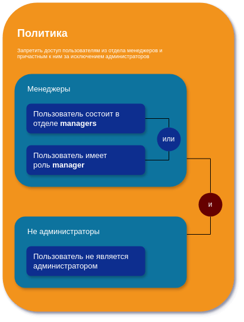

# @via-profit/Ability

> Набор сервисов, частично реализующих
> принцип [Attribute Based Access Control](https://en.wikipedia.org/wiki/Attribute-based_access_control)

Данный сервис позволяет создать правила или политики, а затем применить их по отношению к каким-либо данным для того
чтобы проверить наличие доступа к этим данным.

# Draft

## Содержание

1. [Описание и общие принципы](#overview)

   1.1 [Состав пакета](#structure)

   1.2 [Общие принципы](#principles)

2. [Правила](#rules)

   2.1 [Синтаксис правил](#rule-syntax)

   2.2 [Примеры](#rule-recipes)

   2.3 [Класс AbilityRule](#ability-rule-class)

3. [Политики](#policies)

   3.1 [Синтаксис правил](#policy-syntax)

   3.2 [Примеры](#policy-recipes)

   3.3 [Класс AbilityPolicy](#ability-policy-class)

4. [Создание политики из конфига](#policy-config)

## Описание и общие принципы <a name="overview"></a>

### Состав пакета <a name="structure"></a>

- `AbilityPolicy` - класс политики
- `AbilityRuleSet` - класс группы правил
- `AbilityRule` - класс правила
- `AbilityParser` - парсер конфигурационных правил из/в JSON
- `AbilityResolver` - класс управления политиками
- `AbilityMatch` - Класс констант для определния соответствия правил (`PENDING` `MATCH` `MISMATCH`)
- `AbilityPolicyEffect` - Класс констант для определния эффекта политик (`DENY` `PERMIT`)
- `AbilityCompare` - Класс констант для определния способа сравнения правил и групп (`OR` `AND`)
- `AbilityCondition` - Класс констант для определния метода вычисления правил (`EQUAL` `NOT_EQUAL` `MORE_THAN`
  `LESS_THAN` `LESS_OR_EQUAL` `MORE_OR_EQUAL` `IN` `NOT_IN`)
- `AbilityError` - Класс инстанса ошибки
- `AbilityCode` - Базовый клас констанкт

### Общие принципы <a name="principles"></a>

Принцип работы основан на формировании правил, объединения их в политики и запуске этих политик.

Предположим, что необходимо запретить доступ пользователям из отдела менеджеров и причастным к ним, за исключением
администраторов. Пользователи относятся к отделу менеджеров, если их отдел называется `managers`. Причастные
пользователи являются те пользователи, среди ролей которых имеется роль `manager`. Администраторы - пользователи имеющие
соответствующую роль (`administrator`).

Для решения поставленной задачи нам понадобится объединить несколько правил в группы согласно изображению ниже:



JSON представление такой политики будет иметь следующий вид:

```json
{
  "name": "Запретить доступ пользователям из отдела менеджеров и причастным к ним за исключением администраторов",
  "compareMethod": 1,
  "action": "order.update",
  "effect": 0,
  "ruleSet": [
    {
      "name": "Менеджеры",
      "compareMethod": 0,
      "rules": [
        {
          "name": "Пользователь состоит в отделе managers",
          "matches": [
            "user.department",
            "=",
            "managers"
          ]
        },
        {
          "name": "Пользователь имеет роль manager",
          "matches": [
            "user.roles",
            "in",
            "manager"
          ]
        }
      ]
    },
    {
      "name": "Не администраторы",
      "compareMethod": 1,
      "rules": [
        {
          "name": "Пользователь не является администратором",
          "matches": [
            "user.roles",
            "not in",
            "administrator"
          ]
        }
      ]
    }
  ]
}
```

Теперь для того чтобы применить (проверить политику) необходимо её восстановить из JSON (метод `parse`) и запустить
проверку (метод `check`):

```ts
const jsonConfig = { ... }

const result = AbilityPolicy.parse(jsonConfig).check({
  user: {
    department: 'managers',
    roles: ['manager', 'couch']
  }
});
````

## Правила <a name="rules"></a>

Правила позволяют создавать условия, которые в последствии будут сгруппированы в группу правил, а те, в свою очередь, в
политику.

Класс `AbilityRule`

Правило определяется необязательных названием и обязательным массивом `matches`, который и несёт самую важную роль в
данном модуле.

_Пример простого правила:_

```ts
import { AbilityRule, AbilityCondition } from '@via-profit/ability';

const rule = new AbilityRule({
  name: 'Simple rule',
  matches: [
    'user.department', // dot notation путь до проверяемого поля
    AbilityCondition.EQUAL, // определяет метод сравнения "="
    'managers' // искомое значение
  ],
});

```

Правило выше будет выполнено в случае, если среди проверямых данных будет ключ `user`, содержащий ключ `department`,
значение которого будет равно (`=`) `managers`

Адрес поля `user.department`, представляет собой запись в
формате [dot notation](https://developer.mozilla.org/en-US/docs/Learn/JavaScript/Objects/Basics#dot_notation), что
указывает, что для сравнения данных будет использоваться поле department ресурса `user`.
Для сравнения двух отделов будет использоваться оператор сравнения `=`.

Теперь, для того чтобы проверить правило, необходимо выполнить метод `check` передав необходимые ресурсы:

```ts
import { AbilityRule, AbilityCondition } from '@via-profit/ability';

const rule = new AbilityRule({
  name: 'Simple rule',
  matches: [
    'user.department', // dot notation путь до проверяемого поля
    AbilityCondition.EQUAL, // определяет метод сравнения "="
    'managers' // искомое значение
  ],
});

const result = rule.check({
  user: {
    department: 'managers',
  }
});

```

### Синтаксис правил <a name="rule-syntax"></a>

Для описания правил используется массив следующего типа:

```ts
type AbilityRuleMatches = [
  string, // dot notation путь до поля в субъекте или энвайронменте
    '=' | '<>' | '>' | '<' | '<=' | '>=' | 'in', // оператор сравнения
    string | number | boolean, // dot notation путь до поля в ресурсе или энвайронменте или просто значение
];
```

### Операторы сравнения <a name="rule-operators"></a>

- `AbilityCondition.EQUAL` (`=`) Прямое сравнение
- `AbilityCondition.NOT_EQUAL` (`<>`) Не равно
- `AbilityCondition.MORE_THAN` (`>`) Больше
- `AbilityCondition.LESS_THAN` (`<`) Меньше
- `AbilityCondition.LESS_OR_EQUAL` (`<=`) Меньше или равно
- `AbilityCondition.MORE_OR_EQUAL` (`>=`) Больше или равно
- `AbilityCondition.IN` (`in` Вхождение в массив. Позволяет проверять вхождение значения в массив
- `AbilityCondition.NOT_IN` (`not in` Нет вхождения в массив. Позволяет проверять отсутствие значения в массив

### Примеры правил <a name="rule-recipes"></a>

<details>
<summary>Пользователь старше 21 года</summary>

```ts
const user = {
  age: 18,
};

const isPermit = new AbilityRule('User age', ['subject.age', '>=', 21]).isPermit(user); // true
```

</details>

<details>
<summary>Пользователь имеет роль администратора</summary>

```ts
const user = {
  roles: ['administrator', 'manager'],
};

const isPermit = new AbilityRule('has role', ['subject.roles', 'in', 'administrator']).isPermit(
  user,
); // true
```

</details>

<details>
  <summary>Пользователь является владельцем заказа</summary>

```ts
const user = {
  id: '1',
};

const order = {
  owner: '1',
};

const isPermit = new AbilityRule('owner', ['subject.id', '=', 'resource.owner']).isPermit(
  user,
  order,
); // true
```

</details>

## Политики <a name="policies"></a>

Политики позволяют группировать правила или создавать вложенные друг в друга политики.


## Создание политики из конфига <a name="policy-config"></a>

Политику и правила можно создавать не только по средствам классов, но и при помощи конфигураций.
