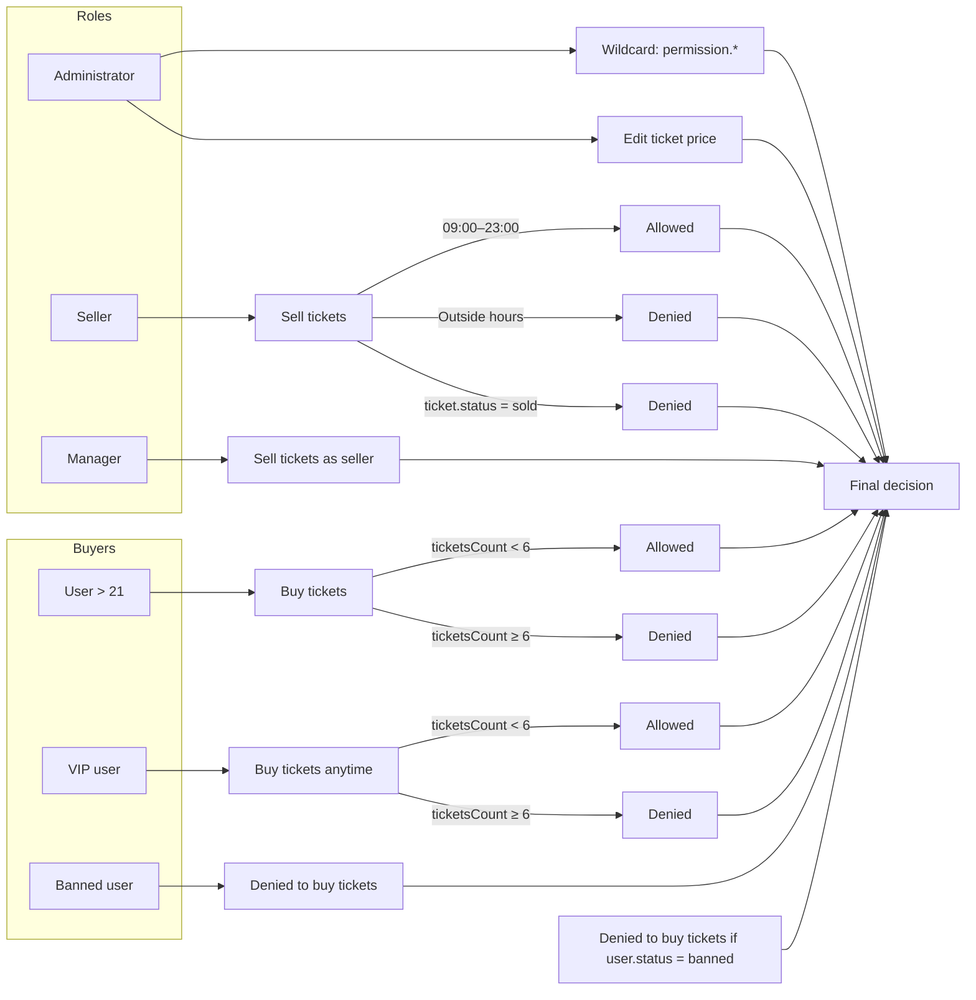

# @via-profit/Ability

> A set of services that partially implement the [Attribute Based Access Control](https://en.wikipedia.org/wiki/Attribute-based_access_control) principle.
> The package allows you to describe rules, combine them into groups, form policies, and apply them to data to determine permissions.


## Language / Язык

- [🇬🇧 English](/docs/en/README.md)
- [🇷🇺 Русский](/docs/ru/README.md)

## Purpose

The package is intended as a **lightweight and extremely simple alternative** to heavy access control systems.  
Without complex configurations, without dependencies — just a minimal set of tools that allows you to describe rules and policies in a maximally simple DSL.

## Table of Contents

- [Quick Start](#quick-start)
- [Fundamentals](#fundamentals)
- [DSL](#dsl)
- [Combining Policies](#combining-policies)
- [Policy Environment](#policy-environment)
- [TypeScript Type Generator](#typescript-type-generator)
- [Policy Debugging](#policy-debugging)
- [Troubleshooting](#troubleshooting)
- [Design Recommendations](#design-recommendations)
- [Examples](#examples)
- [Performance](#performance)
- [API Reference](./api.md)

## Quick Start

Install the package, write DSL, call the parser, and run the resolver.

### Installation

```bash
npm install @via-profit/ability
```

```bash
yarn add @via-profit/ability
```

```bash
pnpm add @via-profit/ability
```

### Example: Deny access to `passwordHash` for everyone except the owner

Suppose we have user data:

```ts
const user = {
  id: '1',
  login: 'user-001',
  passwordHash: '...',
};
```

We need to deny reading `passwordHash` to everyone except the user themselves.

#### DSL Policy

In the policy language, this looks like:

```
deny permission.user.passwordHash if any:
  viewer.id is not equals owner.id
```

**Explanation:**

- `deny` — policy effect (deny access)
- `permission.user.passwordHash` — permission key.
- `if any:` — start of the condition block
- `viewer.id is not equals owner.id` — rule: if the requester's ID is not equal to the owner's ID

If `viewer.id` is not equal to `owner.id`, the rule is satisfied and the policy returns `deny` — access denied. If the IDs match (i.e., the user requests their own data), the rule does not trigger, and access is allowed.

*Note: The permission key is formed according to the principle: `permission.` + your custom key in dot notation. For example, the key `foo.bar.baz` in DSL would be `permission.foo.bar.baz`.*

#### Check in Code

```ts
import { AbilityDSLParser, AbilityResolver } from '@via-profit/ability';

const dsl = `
deny permission.user.passwordHash if any:
  viewer.id is not equals owner.id
`;

const policies = new AbilityDSLParser(dsl).parse(); // obtain policies
const resolver = new AbilityResolver(policies); // create resolver

resolver.enforce('user.passwordHash', {
  viewer: { id: '1' },
  owner: { id: '2' },
}); // will throw an error — access denied
```
In `enforce`, the key is passed without the `permission.` prefix — it is automatically removed by the parser.

## Fundamentals

Let’s briefly list the key points you need to know before starting to use the package:

1. The resolver (`AbilityResolver`) follows the **Default Deny** principle. This means that if no policy matches, the result is `deny` ([more details here](#troubleshooting)). To avoid unexpected `deny`, ensure there is at least one `permit` policy that can match. Only then add `deny` policies.
2. Policies are applied sequentially. If multiple policies match, the result is determined by the last matching policy.
3. Rules are executed sequentially.
4. In a rule set (`RuleSet`) with the `all` comparison operator, further rule execution stops as soon as the first rule returns `mismatch`.
5. Use [DSL](#dsl) to compose policies — it's simpler and more convenient.
6. For storing policies on the server, use JSON. Policies can be exported to JSON and imported from JSON.
7. Generally, rely on the principle: if permission is not explicitly granted → access is denied.
8. Use the built-in cache only if your policies are incredibly complex and contain a large number of rules.

### Interaction Model

First, you define "raw" policies (using DSL, JSON, or classes). Then, you transform the raw data into ready-to-use policies (an array of policies). This is done once and provides a single source of truth. After that, you can perform permission checks in any part of your code using the prepared policies and the resolver.

Policies, rule sets, and rules can be created using:

- DSL (Domain-Specific Language)
- Classes (classic approach)
- JSON

**Creating policies with DSL**

```ts
import { AbilityDSLParser } from '@via-profit/ability';

// Describe policies using Ability-DSL
const dsl = `
  # @name Order creation is only available to persons over 18 years old
  permit permission.order.action.create if all:
    all of:
      user.age gte 18

  # @name Price editing is only available to administrators
  permit permission.order.data.price if all:
    all of:
      user.roles contains 'administrator'
`;

// Define resource types for TypeScript
// Types can be generated automatically (more on this later) or defined manually
// In this example, for simplicity, types are defined manually
type Resources = {
  ['order.action.create']: {
    user: {
      age: number;
    }
  }
  ['order.data.price']: {
    user: {
      roles: string[];
    }
  }
}

// Use the parser to create policies
// Pass the resource type as a generic parameter
const policies = new AbilityDSLParser<Resources>(dsl).parse(); // AbilityPolicy[]

// The parser returns an array of policies even
// if only one policy is described in the DSL
console.log(policies); // [AbilityPolicy, AbilityPolicy, ...]

// Export the ready-to-use policies
export default policies;
```

For more details about DSL, see the [DSL](#dsl) section.

**Creating policies using classes (classic approach)**

This approach is quite verbose but gives you full control over the policies.

```ts
import { AbilityPolicy, AbilityRuleSet, AbilityRule, AbilityCompare, AbilityPolicyEffect } from '@via-profit/ability';

// Define resource types for TypeScript
// Types can be generated automatically (more on this later) or defined manually
// In this example, for simplicity, types are defined manually
type Resources = {
  ['order.action.create']: {
    user: {
      age: number;
    }
  }
  ['order.data.price']: {
    user: {
      roles: string[];
    }
  }
}

const policies = [
  // first policy
  new AbilityPolicy<Resources>({
    id: '1',
    name: 'Order creation is only available to persons over 18 years old',
    compareMethod: AbilityCompare.and,
    effect: AbilityPolicyEffect.permit,
    permission: 'order.action.create',
  }).addRuleSet(
    AbilityRuleSet.and([
      // rule
      AbilityRule.moreOrEqual('user.age', 18),
    ]),
  ),

  // second policy
  new AbilityPolicy<Resources>({
    id: '2',
    name: 'Price editing is only available to administrators',
    compareMethod: AbilityCompare.and,
    effect: AbilityPolicyEffect.permit,
    permission: 'order.data.price',
  }).addRuleSet(
    AbilityRuleSet.and([
      // rule
      AbilityRule.contains('user.roles', 'administrator'),
    ])
  ),
];

// Export the ready-to-use policies
export default policies;
```

**Creating policies with JSON**

JSON allows you to store policies in a file or database, for example, in PostgreSQL, which supports working with JSON data.

Policy, rule set, and rule classes have JSON export methods, so you can create policies in any way and export them to JSON whenever needed.

```ts
import { AbilityJSONParser } from '@via-profit/ability';

// Define resource types for TypeScript
// Types can be generated automatically (more on this later) or defined manually
// In this example, for simplicity, types are defined manually
type Resources = {
  ['order.action.create']: {
    user: {
      age: number;
    }
  }
  ['order.data.price']: {
    user: {
      roles: string[];
    }
  }
}

// Parse JSON using AbilityJSONParser
// Pass the resource types as a generic parameter
const policies = AbilityJSONParser.parse<Resources>([
  {
    id: '1',
    name: 'Order creation is only available to persons over 18 years old',
    effect: 'permit',
    permission: 'order.action.create',
    compareMethod: 'and',
    ruleSet: [
      {
        compareMethod: 'and',
        rules: [
          {
            subject: 'user.age',
            resource: 18,
            condition: '>',
          }
        ]
      }
    ],
  },
  {
    id: '2',
    name: 'Price editing is only available to administrators',
    effect: 'permit',
    permission: 'order.data.price',
    compareMethod: 'and',
    ruleSet: [
      {
        compareMethod: 'and',
        rules: [
          {
            subject: 'user.roles',
            resource: 'administrator',
            condition: 'contains',
          }
        ]
      }
    ]
  }
]);

export default policies;
```
---

## DSL

> DSL - Domain-Specific Language

Ability DSL is a declarative language for describing access policies.  
It allows you to define rules in a human-readable form using simple constructs: *policies*, *groups*, *rules*, and *annotations*.

### Policy Structure

A policy consists of:

```
<effect> <permission> if <all|any>:
  <group>...
```

Where:

- **effect** — `permit` or `deny`
- **permission** — a string of the form `permission.foo.bar`, where the `permission.` prefix is mandatory.
- **if all:** — all groups must be true
- **if any:** — at least one group must be true

A policy can contain one or more rule groups.

Example:

```dsl
permit permission.order.update if any:
  all of:
    user.roles contains 'admin'
    user.token is not null

  any of:
    user.roles contains 'developer'
    user.login is equals 'dev'
```

> The `permission.` prefix is mandatory in DSL but is automatically removed by the parser. Internally, the permission is stored as `order.update`.

The example policy above says: permission `order.update` will be allowed if one of two conditions is met:
1. `user.roles` contains 'admin' **and** `user.token` is not null
2. `user.roles` contains 'developer' **or** `user.login` equals 'dev'

### Permission Key

Permission keys are written in dot notation but support the use of wildcard patterns with the `*` character. This allows grouping of keys and overriding policies with similar keys.

If multiple policies match a key, **all of them are executed**. The final result is determined by the **last matching policy**:

**Example of using wildcards**

| Policy (permission) | Key                   | Matches |
|---------------------|-----------------------|---------|
| `order.*`           | `order.create`        | yes     |
| `order.*`           | `order.update`        | yes     |
| `order.*`           | `user.create`         | no      |
| `*.create`          | `order.create`        | yes     |
| `*.create`          | `user.create`         | yes     |
| `*.create`          | `order.update`        | no      |
| `user.profile.*`    | `user.profile.update` | yes     |
| `user.profile.*`    | `user.settings.update`| no      |

**Example of a policy with wildcard**
```ts
import { AbilityDSLParser, AbilityResolver } from '@via-profit/ability';

// DSL is not complete, shown for illustration only
const dsl = `
permit permission.order.*
deny permission.order.update
`;

const policies = new AbilityDSLParser(dsl).parse();
const resolver = new AbilityResolver(policies);

resolver.enforce('order.update', resource); // will throw AbilityError
```

**Explanation**

In DSL, the order of policies matters:
the last matching policy wins.

Therefore:

1. `permit` `permission.order.*` allows everything that starts with `order.`
2. `deny` `permission.order.update` overrides this permission.

Execution result:

```
order.update → deny
order.create → permit
order.delete → permit
order.view   → permit
```

### Comments

Lines starting with the `#` symbol are considered comments and do not affect the evaluation of rules and policies.

---

### Annotations

Currently, only one annotation is supported: `name`, which will be used as the name for a policy, rule group, or rule.

Annotations are specified via comments:

```
# @name <name>
```

Annotations apply to the **following entity**:

- policy
- group
- rule

Example:

```dsl
# @name can order update
permit permission.order.update if any:
  # @name authorized admin
  all of:
    # @name contains role admin
    user.roles contains 'admin'
```

---

### Rule Groups

A group defines how the rules within it are combined:

```
all of:
  <rule>
  <rule>

any of:
  <rule>
  <rule>
```

- `all of:` — logical AND
- `any of:` — logical OR

`all of` means that the group is considered satisfied if all rules within the group match.

`any of` means that the group is considered satisfied if at least one rule within the group matches.

Each group within a policy will be evaluated independently of other groups. The final result is determined by comparing the results of all groups in the policy.

Groups can have annotations:

```dsl
# @name developer group
any of:
  user.roles contains 'developer'
```

---

### Rules

A rule is an atomic condition inside a policy. It defines under what data the policy is considered matched. Rules set the conditions that determine the effectiveness of a policy (`permit` or `deny`).

A rule has the form:

```
<subject> <operator> <value?> — the value is not required for some operators (e.g., `is null` does not require a value).
```

#### Subject

Identifier in dot notation:

```
user.roles
env.time.hour
order.total
```

#### Operators

*Synonyms are alternative forms of writing that are also supported by the parser.*

**Basic Comparison Operators**

| DSL Operator | Synonyms | Example | Description | Types |
|--------------|----------|---------|-------------|-------|
| **is equals** | `=`, `==`, `equals` | `age is equals 18` | Strict equality | number, string, boolean |
| **is not equals** | `!=`, `<>`, `not equals` | `role is not equals 'admin'` | Strict inequality | number, string, boolean |
| **greater than** | `>`, `gt` | `age greater than 18` | Greater than | number, date |
| **greater than or equal** | `>=`, `gte` | `age greater than or equal 18` | Greater than or equal | number, date |
| **less than** | `<`, `lt` | `age less than 18` | Less than | number, date |
| **less than or equal** | `<=`, `lte` | `age less than or equal 18` | Less than or equal | number, date |

**Null Operators**

| DSL Operator | Synonyms | Example | Description | Types |
|--------------|----------|---------|-------------|-------|
| **is null** | `== null`, `= null` | `middleName is null` | Value is absent | any |
| **is not null** | `!= null` | `middleName is not null` | Value is present | any |

**Operators for Lists (Arrays)**

| DSL Operator | Synonyms                  | Example | Description | Types |
|--------------|---------------------------|---------|-------------|-------|
| **in [...]** | -                         | `role in ['admin', 'manager']` | Value is in the list | number, string |
| **not in [...]** | -                         | `role not in ['banned']` | Value is not in the list | number, string |
| **contains** | `includes`, `has`         | `tags contains 'vip'` | Array contains the element | array |
| **not contains** | `not includes`, `not has` | `tags not contains 'vip'` | Array does not contain the element | array |

**Boolean Operators**

| DSL Operator | Synonyms | Example | Description | Types |
|--------------|----------|---------|-------------|-------|
| **is true** | `= true` | `isActive is true` | Value is true | boolean |
| **is false** | `= false` | `isActive is false` | Value is false | boolean |

**Length Operators**

| DSL Operator | Synonyms | Example | Description | Types |
|--------------|----------|---------|-------------|-------|
| **length equals** | `len =` | `tags length equals 3` | Length equals | array, string |
| **length greater than** | `len >` | `tags length greater than 2` | Length greater than | array, string |
| **length less than** | `len <` | `tags length less than 5` | Length less than | array, string |

Here is the English version, keeping the structure and tone consistent with your documentation style.

**Special Operators**

| DSL Operator | Synonyms | Example | Description | Types |
|--------------|----------|---------|-------------|--------|
| **always** | — | `always` | The condition is always true. Used for global allow rules or simplifying logic. | special operator |
| **never** | — | `never` | The condition is always false. Used for global deny rules or disabling a rule. | special operator |


**always**
An operator that always returns `true`.  
Used for:

- global allow (`permit permission.* if all: always`)
- testing
- disabling complex conditions
- creating fallback rules

**never**
An operator that always returns `false`.  
Used for:

- global deny (`deny permission.* if all: never`)
- temporarily disabling a rule
- explicit unconditional rejection


#### Value

Supported values:

- strings `'text'`
- numbers `42`
- booleans `true` / `false`
- `null`
- arrays `[1, 2, 3]` / `['foo', false, null, 1, 2, '999']`

Examples:

```dsl
# user age greater than 18
user.age greater than 18

# array of roles contains the role 'admin'
user.roles contains 'admin'

# order tag is either 'vip' or 'priority'
order.tag in ['vip', 'priority']

# user token is not null
user.token is not null

# user login is longer than 12 characters
user.login length greater than 12
```

---

### Implicit Group

If rules are written without `all of:` or `any of:`, they are combined using the policy operator:

```dsl
permit permission.order.update if all:
  user.roles contains 'admin'
  user.token is not null
```

Equivalent to:

```dsl
permit permission.order.update if all:
  all of:
    user.roles contains 'admin'
    user.token is not null
```

The implicit group always matches the policy operator (`if all` or `if any`).

---

### Complete Example

```dsl
# @name order update allowed
permit permission.order.update if any:

  # @name if admin
  all of:
    user.roles contains 'admin'
    user.token is not null

  # @name if developer
  any of:
    user.roles contains 'developer'
    user.login is equals 'dev'
```

## Combining Policies

In a real project, you should use multiple policies at once.

TODO: using multiple policies

## Policy Environment

**Environment** is an object containing context data that does not belong to either the user or the resource.  
The content of the object is defined by the developer and can be any object consisting of primitives.

- request time,
- IP address,
- device parameters,
- request headers,
- session context,
- any other external conditions.


Environment is passed to `resolve()` and `enforce()` as the third argument:

```ts
const environment = {
  time: {
    hour: new Date().getHours(),
  },
  ip: req.ip,
}

resolver.enforce('order.update', resource, environment);
```

### Using environment in rules

In a policy, you can refer to environment via the `env.*` path.

Example policy that denies order updates at night (10 PM – 6 AM):

```dsl
# @name Deny updates at night
deny permission.order.update if all:
  env.time.hour less than 6 
  env.time.hour greater or equal than 22
```

**Retrieving values from environment**

If a path is specified in a rule:

- `env.*` → value is taken from environment
- `user.*`, `order.*`, `profile.*` → from resource
- literal (`18`, `"admin"`, `true`) → used as is

Example:

```ts
subject: "env.geo.country"
resource: "user.country"
condition: "equal"
```

### Environment in TypeScript

The Environment type is set at the `AbilityResolver` level:

```ts
const resolver = new AbilityResolver<Resources, Environment>(policies);
```

This allows:

- getting autocompletion in IDE,
- checking the correctness of `env.*` paths,
- avoiding errors when passing environment.

> If a rule uses `env.*` but environment is not passed, then the value of `env.*` will be `undefined`, and the comparison will be performed as if the environment were absent.

## TypeScript Type Generator

`AbilityTypeGenerator.generateTypeDefs(policies)` generates TypeScript types based on policies, allowing you to avoid inconsistencies between types and the data in the policies.

**Example usage**

Policies can be stored in DSL or JSON. This example uses a DSL file.

_policies/policies.dsl_
```
# @name Update order
permit permission.order.update if all:

  # @name Owner check
  all of:
    # @name User is owner
    user.id = order.ownerId
```

_scripts/policies.js_
```js
const fs = require('node:fs');
const path = require('node:path');
const { AbilityTypeGenerator, AbilityDSLParser } = require('@via-profit/ability');

// Prepare paths
const dslPath = path.resolve(__dirname, '../src/policies/policies.dsl');
const typeDefsPath = path.join(path.dirname(dslPath), 'policies.types.ts');

// Read DSL as a string
const dsl = fs.readFileSync(dslPath, {encoding: 'utf-8'});

// Create policies
const policies = new AbilityDSLParser(dsl).parse();

// Generate TypeScript types
const typeDefs = new AbilityTypeGenerator(policies).generateTypeDefs();

// Save TypeScript types to file
fs.writeFileSync(typeDefsPath, typeDefs, {encoding: 'utf-8'});
```

_policies/index.ts_
```ts
import { AbilityDSLParser, AbilityResolver } from '@via-profit/ability';
import type { Resources } from './policies.types';
import dsl from './policies.dsl';

const policies = new AbilityDSLParser<Resources>(dsl).parse();

export const policyResolver = new AbilityResolver(new AbilityDSLParser<Resources>(dsl).parse());

export default policyResolver;

```

**Generated file (example)**

```ts
// src/ability/types.generated.ts

// Automatically generated by via-profit/ability
// Do not edit manually
export type Resources = {
  'order.update': {
    readonly user: {
      readonly id: string;
    };
    readonly order: {
      readonly ownerId: string;
    };
  };
};
```

**Usage in code**

```ts
import { policyResolver } from './policies';

resolver.enforce('order.update', {
  user: { id: 'u1' },
  order: { ownerId: 'u1' },
});
```

## Policy Debugging

### Explanations

To simplify policy debugging, a special `AbilityResult` class is used, which is already included in the final evaluation result. `AbilityResult` encapsulates the outcome of applying all matching policies to a permission key and resource.

`AbilityResult` contains:

- a list of evaluated policies,
- methods to determine the final effect,
- methods to get explanations in textual representation.

Example:

```ts
const result = resolver.resolve('order.update', resource);

if (result.isDenied()) {
  console.log('Access denied');
}

const explanations = result.explain(); // AbilityExplain

// console.log(explanations.toString());
```

### AbilityExplain

`AbilityExplain` and related classes (`AbilityExplainPolicy`, `AbilityExplainRuleSet`, `AbilityExplainRule`) allow you to get a human-readable explanation:

- which policy matched,
- which rule groups matched,
- which rules did not pass,
- which effect was applied.

Usage example:

```ts
const result = resolver.resolve('order.update', resource);
const explanations = result.explain();

console.log(explanations.toString());
```

Example output:

```
✓ policy «Deny order update for managers» is match
  ✓ ruleSet «Managers» is match
    ✓ rule «Department managers» is match
    ✗ rule «Role manager» is mismatch
  ✓ ruleSet «Not administrators» is match
    ✓ rule «No role administrator» is match
```

### Output Format

Currently, only one output format is supported — textual.

The output follows the principle: `<policy | ruleSet | rule> <name> <is match | is mismatch>`

## Troubleshooting

### Decision‑Making Model (Default Deny)

> Why does a `deny` policy not turn into `permit` if its conditions are not met?

Consider a policy that **denies** access to a user aged 16:

```ts
const dsl = `
deny permission.test if all:
  user.age is equals 16
`;

const policies = new AbilityDSLParser(dsl).parse();
const resolver = new AbilityResolver(policies);

const result = resolver.resolve('test', {
  user: { age: 16 },
});

console.log(result.isDenied());  // true  ✔
console.log(result.isAllowed()); // false ✔
```

In this case, everything is obvious:  
the condition is met → the policy matches → effect `deny` → access denied.

**What happens if the conditions are *not met*?**

```ts
const result = resolver.resolve('test', {
  user: { age: 12 },
});

console.log(result.isDenied());  // true  ✔
console.log(result.isAllowed()); // false ✔
```

At first glance, it might seem that if the condition is not met, the policy should “allow” access.  
But that is **not the case**.

**Decision‑Making Model: `Default Deny`**

`AbilityResolver` uses the classic security model:

> **If there is no matching permit‑policy → access is denied.**

**What happens in this example:**

1. The `deny` policy exists, but its condition is **not met**  
   → the policy gets status `mismatch`.

2. The `deny` policy **is not applied** because the conditions did not match.

3. There is no `permit` policy.

4. Since there is no permit policy → the final decision:  
   **deny (by default)**.

**Summary**

- `deny` with matching conditions → **deny**
- `deny` with non‑matching conditions → **deny (default deny)**
- `permit` with matching conditions → **allow**
- `permit` with non‑matching conditions → **deny (default deny)**

**Conclusion**

**Access is allowed only if there is an explicit permit.**

## Design Recommendations

### Naming Access Keys

- Use hierarchical keys: `permission.order.create`, `permission.order.update.status`, `permission.user.profile.update`.
- Group by domains: `permission.user.*`, `permission.order.*`, `permission.product.*`.
- Do not mix different domains in one key.

### Data Structure

- Explicitly describe `Resources` in TypeScript.
- Do not pass “extra” fields — this complicates understanding.
- Strive to keep the data structure for a given `permission` stable.

### Policy Design

- General rules — via wildcard (`permission.order.*`).
- Specific restrictions — via exact actions (`permission.order.update`).
- Use `effect: deny` for prohibitions.
- Use `effect: permit` for permissions.

### Common Mistakes

- Expecting that absence of matching policies means allow.
- Mixing business logic and access policies.
- Too large policies with dozens of rules — better to break them down.

### Example of Use on the Frontend (React)

**Hook for checking policies**

```tsx
// hooks/use-ability.ts
import { useEffect, useState } from 'react';
import { AbilityResolver } from '@via-profit/ability';
import { Resources } from './generated-types';

export function useAbility<Permission extends keyof Resources>(
  resolver: AbilityResolver<Resources>,
  permission: Permission,
  resource: Resources[Permission],
) {
  const [allowed, setAllowed] = useState<boolean | null>(null);

  useEffect(() => {
    let cancelled = false;

    async function check() {
      try {
        const result = resolver.resolve(permission, resource);
        if (!cancelled) {
          setAllowed(result.isAllowed());
        }
      } catch {
        if (!cancelled) {
          setAllowed(false);
        }
      }
    }

    check();

    return () => {
      cancelled = true;
    };
  }, [resolver, permission, resource]);

  return allowed;
}
```

**Usage in a component**

```tsx
function OrderUpdateButton({ order, user }) {
  const allowed = useAbility(resolver, 'order.update', {
    user,
    order,
  });

  if (allowed === null) {
    return null; // or loading spinner
  }

  if (!allowed) {
    return null;
  }

  return <button>Update order</button>;
}
```

## Examples

### Example of a Complex Multi‑Level Policy

Below is a multi‑level set of policies, using a cinema example (fictional).

**The example demonstrates:**
- working with roles (admin, seller, manager, VIP, banned),
- time constraints (`env.time.hour`),
- wildcard permissions (`permission.*`),
- ticket quantity limits,
- prohibition on selling already sold tickets,
- combination of `permit`/`deny` policies,
- policy priority and Default Deny model.

**Brief description of rules**
- **Administrator**  
  Has wildcard permissions (`permission.*`) and can perform any action.  
  Can edit ticket prices.

- **Seller**  
  Can sell tickets only during working hours (09:00–23:00).  
  Cannot sell tickets if:
    - the cinema is closed,
    - the ticket is already sold.

- **Manager**  
  Has the same rights as a seller.

- **Buyers**
    - A user older than 21 can buy tickets.
    - A VIP user can buy tickets at any time.
    - A banned user (`status = banned`) cannot buy tickets.
    - Any user cannot buy more than 6 tickets.

**Policy Diagram**


```mermaid
flowchart LR

%% ==== ROLES ====

   subgraph Roles[Roles]
      A[Administrator]
      B[Seller]
      C[Manager]
   end

   subgraph Buyers[Buyers]
      U1[User > 21]
      U2[VIP user]
      U3[Banned user]
   end

%% ==== ADMIN ====

   A --> A1[Wildcard: permission.*]
   A --> A2[Edit ticket price]

   A1 --> FINAL[Final decision]
   A2 --> FINAL

%% ==== SELLER ====

   B --> B1[Sell tickets]

   B1 -->|09:00–23:00| B2[Allowed]
   B1 -->|Outside hours| D2[Denied]
   B1 -->|ticket.status = sold| D3[Denied]

   B2 --> FINAL
   D2 --> FINAL
   D3 --> FINAL

%% ==== MANAGER ====

   C --> C1[Sell tickets as seller]
   C1 --> FINAL

%% ==== BUYERS ====

   U1 --> U1A[Buy tickets]
   U1A -->|ticketsCount < 6| U1OK[Allowed]
   U1A -->|ticketsCount ≥ 6| U1DENY[Denied]

   U2 --> U2A[Buy tickets anytime]
   U2A -->|ticketsCount < 6| U2OK[Allowed]
   U2A -->|ticketsCount ≥ 6| U2DENY[Denied]

   U3 --> U3A[Denied to buy tickets]

   U1OK --> FINAL
   U1DENY --> FINAL
   U2OK --> FINAL
   U2DENY --> FINAL
   U3A --> FINAL

%% ==== DENY RULES ====

   D1[Denied to buy tickets if user.status = banned] --> FINAL
```

**DSL Policies**

```dsl
############################################################
# @name Admin can edit ticket price
permit permission.ticket.price.edit if all:
  user.role is equals 'admin'


############################################################
# @name Seller can sell tickets during working hours
permit permission.ticket.sell if all:
  user.role is equals 'seller'
  all of:
    env.time.hour greater than or equal 9
    env.time.hour less than or equal 23


############################################################
# @name Users older than 21 can buy tickets
permit permission.ticket.buy if all:
  user.age greater than 21


############################################################
# @name VIP users can buy tickets anytime
permit permission.ticket.buy if all:
  user.isVIP is true


############################################################
# @name Deny buying tickets if user is banned
deny permission.ticket.buy if all:
  user.status is equals 'banned'


############################################################
# @name Deny selling tickets if cinema is closed
deny permission.ticket.sell if all:
  any of:
    env.time.hour less than 9
    env.time.hour greater than 23


############################################################
# @name Manager can do everything seller can
permit permission.ticket.sell if all:
  user.role is equals 'manager'


############################################################
# @name Admin wildcard permissions
permit permission.* if all:
  user.role is equals 'admin'


############################################################
# @name Limit tickets per user (max 6)
deny permission.ticket.buy if all:
  user.ticketsCount greater than or equal 6


############################################################
# @name Cannot sell already sold tickets
deny permission.ticket.sell if all:
  ticket.status is equals 'sold'
```

Below is how to use the policies above in Node.js + TypeScript.

**Preparing Policies**

```ts
import { AbilityDSLParser } from '@via-profit/ability';
import cinemaDSL from './policies/cinema.dsl';

export const policies = new AbilityDSLParser(cinemaDSL).parse();
```

**Creating the Resolver**

```ts
import { AbilityResolver } from '@via-profit/ability';
import { policies } from './policies';

const resolver = new AbilityResolver(policies);
```

**Checking Permissions (enforce)**

Example: buying a ticket.

The `enforce` method throws an `AbilityError` if access is denied.

```ts
resolver.enforce('ticket.buy', {
  user: { age: 25, ticketsCount: 1 },
  env: { time: { hour: 18 } },
});
```
If allowed — the code continues execution.  
If denied — an `AbilityError` exception is thrown.

**Checking Permissions Without Exceptions (resolve)**

`resolve` returns a result object:

```ts
const result = resolver.resolve('ticket.buy', {
  user: { age: 25, ticketsCount: 1 },
  env: { time: { hour: 18 } },
});

if (result.isAllowed()) {
  console.log('Purchase allowed');
} else {
  console.log('Purchase denied');
}
```

**Seller can only sell during working hours**

```ts
resolver.enforce('ticket.sell', {
  user: { role: 'seller' },
  env: { time: { hour: 15 } },
  ticket: { status: 'available' },
});
```

**Preparing Data for the Resolver**

In the examples above, constant objects are passed to the resolver:

```ts
resolver.enforce('ticket.buy', {
  user: { age: 25 },
  env: { time: { hour: 18 } },
});
```

This is done for clarity. In a real application, the data for the resolver should be built dynamically — from the sources available to your server.

**User** (`user`) is usually taken from:

- JWT token
- session
- database
- authorization middleware

Example:

```ts
const user = await db.users.findById(session.userId);
```

**Environment** (`env`)

These are any external parameters that can affect access:

- current server time
- time zone
- IP address
- request headers
- system configuration

Example:

```ts
const env = {
  time: {
    hour: new Date().getHours(),
  },
  ip: req.ip,
};
```

**Resource** (e.g., `ticket`)

If the action is associated with a specific object, it also needs to be loaded:

```ts
const ticket = await db.tickets.findById(req.params.ticketId);
```

**Context**

Context is the object that you pass to `resolve` or `enforce`.  
It contains **all the data** that policies might need:

- `user` — data about the current user
- `env` — environment data (time, IP, geography, system settings)
- `resource` or `ticket` — data about the entity on which the action is performed
- any other objects that you use in DSL

**It is important to understand:**

> Context is formed for a specific action and specific policies. It does not need to be stored in advance — you gather it dynamically before calling the resolver.

## Performance

The tests used policies with 10 conditions, nested fields, and environment.

**Tinybench** ([https://github.com/tinylibs/tinybench](https://github.com/tinylibs/tinybench))

| # | Task name                              | Latency avg (ns)      | Latency med (ns)      | Throughput avg (ops/s) | Throughput med (ops/s) | Samples |
|---|-----------------------------------------|------------------------|------------------------|--------------------------|--------------------------|---------|
| 0 | resolve() — no cache (heavy rules)      | 646317 ± 0.32%         | 632319 ± 8446.0        | 1555 ± 0.21%             | 1581 ± 21                | 3095    |
| 1 | resolve() — cold cache (heavy rules)    | 636363 ± 0.38%         | 623092 ± 7885.0        | 1581 ± 0.21%             | 1605 ± 20                | 3143    |
| 2 | resolve() — warm cache (heavy rules)    | 631328 ± 0.26%         | 621152 ± 6562.5        | 1590 ± 0.17%             | 1610 ± 17                | 3168    |

```
Latency (ns)
650k | ███████████████████████████████████████ resolve() — no cache
640k | █████████████████████████████████████ resolve() — cold cache
630k | ████████████████████████████████████ resolve() — warm cache
      --------------------------------------------------------------
        no cache            cold cache            warm cache
```

```
Throughput (ops/s)
1600 | ███████████████████████████████████████ resolve() — warm cache
1590 | ██████████████████████████████████████ resolve() — cold cache
1580 | █████████████████████████████████████ resolve() — no cache
      --------------------------------------------------------------
        no cache            cold cache            warm cache
```

## License

This project is licensed under the MIT License. See the [LICENSE](/LICENSE) file for details.
