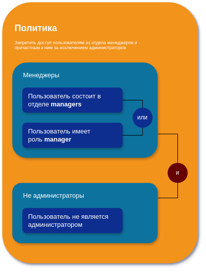

# @via-profit/Ability

> Набор сервисов, частично реализующих
> принцип [Attribute Based Access Control](https://en.wikipedia.org/wiki/Attribute-based_access_control)

Этот сервис позволяет создавать правила и политики, применять их к данным и проверять доступ на их основе.

## Содержание

- [Обзор](#обзор)
  - [Состав пакета](#состав-пакета)
  - [Основные принципы](#основные-принципы)
- [Правила](#правила)
  - [Создание правила](#создание-правила)
  - [Проверка правила](#проверка-правила)
- [Группы правил](#группы-правил)
  - [Создание группы правил](#создание-группы-правил)
  - [Проверка группы правил](#проверка-группы-правил)
- [Политики](#политики)
  - [Создание политики](#создание-политики)
  - [Проверка политики](#проверка-политики)
- [Управление политиками](#управление-политиками)
  - [Зачем нужен AbilityResolver?](#зачем-нужен-abilityresolver)
  - [Использование wildcard (\*) в действиях](#использование-wildcard--в-действиях)
  - [Как это работает](#как-это-работает)
  - [Проверка соответствия действия](#проверка-соответствия-действия)
  - [Методы AbilityResolver](#методы-abilityresolver)
  - [Интеграция с TypeScript](#интеграция-с-typescript)
  - [Как формируется итоговое решение?](#как-формируется-итоговое-решение)
  - [Когда использовать Resolver?](#когда-использовать-resolver)
- [API Reference](#api-reference)
  - [Класс AbilityCode](#класс-abilitycode)
  - [Класс AbilityMatch](#класс-abilitymatch)
  - [Класс AbilityCondition](#класс-abilitycondition)
  - [Класс AbilityCompare](#класс-abilitycompare)
  - [Класс AbilityPolicyEffect](#класс-abilitypolicyeffect)
  - [Класс AbilityRule](#класс-abilityrule)
  - [Класс AbilityRuleSet](#класс-abilityruleset)
  - [Класс AbilityPolicy](#класс-abilitypolicy)
  - [Класс AbilityResolver](#класс-abilityresolver)
  - [Класс AbilityExplain](#класс-abilityexplain)
  - [Класс AbilityParser](#класс-abilityparser)
  - [Класс AbilityResult](#класс-abilityresult)
  - [Классы ошибок](#классы-ошибок)
- [Рекомендации по использованию](#рекомендации-по-использованию)
  - [Именование экшенов](#именование-экшенов)
  - [Структура данных](#структура-данных)
  - [Проектирование политик](#проектирование-политик)
- [Отладка политик](#отладка-политик)
- [Лицензия](#лицензия)

---

## Обзор

### Состав пакета

- **`AbilityRule`** — класс отдельного правила
- **`AbilityRuleSet`** — класс группы правил
- **`AbilityPolicy`** — класс политики
- **`AbilityResolver`** — управление политиками
- **`AbilityMatch`** — константы состояния правил (`pending`, `match`, `mismatch`)
- **`AbilityCompare`** — способы сравнения (`or`, `and`)
- **`AbilityCondition`** — методы вычисления (`equal`, `not_equal`, `more_than`, `less_than`, `in`, `not_in` и др.)
- **`AbilityPolicyEffect`** — эффекты политики (`deny`, `permit`)
- **`AbilityParser`** — парсер конфигурационных правил (JSON) и генератор `Typescript` типов
- **`AbilityError`** — инстанс ошибок
- **`AbilityExplain`** — вспомогательный инструмент, который позволяет получить человекочитаемое объяснение того, почему конкретное действие разрешено или запрещено текущей конфигурацией Ability

### Основные принципы

Работа сервиса основана на формировании **правил**, объединении их в **политики** и проверке доступа с их помощью.

Пример: необходимо **запретить доступ** пользователям, связанным с отделом менеджеров, **за исключением администраторов**.

- Менеджеры — если их отдел `managers` или есть роль `manager`
- Администраторы — пользователи с ролью `administrator`

Структура политики:



JSON-конфигурация:

```json
{
  "name": "Запрет доступа для менеджеров (исключение: администраторы)",
  "compareMethod": "and",
  "action": "order.update",
  "effect": "deny",
  "ruleSet": [
    {
      "name": "Менеджеры",
      "compareMethod": "or",
      "rules": [
        {
          "name": "Отдел managers",
          "subject": "user.department",
          "resource": "managers",
          "condition": "in"
        },
        {
          "name": "Роль manager",
          "subject": "user.roles",
          "resource": "manager",
          "condition": "in"
        }
      ]
    },
    {
      "name": "Не администраторы",
      "compareMethod": "and",
      "rules": [
        {
          "name": "Нет роли administrator",
          "subject": "user.roles",
          "resource": "administrator",
          "condition": "not in"
        }
      ]
    }
  ]
}
```

Применение политики:

```ts
const jsonConfig = { ... };
AbilityPolicy.parse(jsonConfig).check({
  user: {
    department: 'managers',
    roles: ['manager', 'coach'],
  }
});
```

---

## Правила

**Правила** выполняют условие проверки и возвращают результат. **Основная цель** - выполнить сравнение переданных
значений субъекта и ресурса, а затем вернуть результат такого сравнения.

### Создание правила

Создать правило можно двумя способами: создание через конструктор класса и парсинг JSON-конфига правила.

При создании необходимо указать следующие параметры:

- **id** - `string` Уникальный идентификатор.
- **name** - `string` Название правила.
- **condition** - `AbilityCondition` Определяет условия сравнения переданных данных
- **subject** - `string` Dot notation путь в проверяемом субъекте, например: `user.name`.
- **resource** - `string | number | boolean | (string | number)[]` Dot notation путь в проверяемом ресурсе, например:
  `user.name` или значение, которое может быть строкой, числом, булеан значением или массивом строк, или чисел.

_Создание правила через конструктор класса:_

```ts
import { AbilityRule, AbilityCondition } from '@via-profit/ability';

const rule = new AbilityRule({
  id: '<rule-id>',
  name: 'Пользователь из отдела managers',
  subject: 'user.department',
  resource: 'managers',
  condition: AbilityCondition.equal,
});

// сокращённая запись
const rule2 = AbilityRule.equal(
  'user.department', // subject
  'managers', // resource
);
```

_Создание правила через парсинг JSON-конфигурации:_

```ts
import { AbilityRule } from '@via-profit/ability';

const rule = AbilityRule.parse({
  id: '<rule-id>',
  name: 'Пользователь из отдела managers',
  subject: 'user.department',
  resource: 'managers',
  condition: '=',
});
```

### Проверка правила

Для проверки правила следует вызвать метод `check` класса `AbilityRule` передав объект проверяемого ресурса. Этот метод
вернёт экземпляр класса
`AbilityMatch`, при помощи методов которого можно определить имеется ли совпадение правила и переданных значений.

```ts
import { AbilityRule } from '@via-profit/ability';

const rule = AbilityRule.parse({
  id: '<rule-id>',
  name: 'Пользователь из отдела managers',
  subject: 'user.department',
  resource: 'managers',
  condition: '=',
});

const match = rule.check({
  user: {
    department: 'managers',
  },
});

const is = match.isEqual(AbilityMatch.match); // true
```

## Получение пояснений (AbilityExplain)

Для отладки или аудита может быть полезно понять, _почему_ было вынесено то или иное суждение о правах доступа. Метод `resolveWithExplain()` политики возвращает детальную информацию о проверке.

### Использование

```ts
const config: AbilityPolicyConfig = {
  id: 'bb758c1b-1015-4894-ba25-d23156e063cf',
  name: 'Запрещает менять статус заявки с `не обработан` на `завершен` всем, кроме администраторам',
  action: 'order.status',
  effect: 'deny',
  compareMethod: 'and',
  ruleSet: [
    {
      id: '9cc009e5-0aa9-453a-a668-cb3f418ced92',
      name: 'Не администратор',
      compareMethod: 'and',
      rules: [
        {
          id: '4093cd50-e54f-4062-8053-2d3b5966fad3',
          name: 'Нет роли администраторов',
          subject: 'user.roles',
          resource: 'administrator',
          condition: 'not in',
        },
      ],
    },
    {
      id: '2f8f9d71-860b-4fa6-b395-9331f1f0848e',
      name: 'Проверка статуса `не обработан` -> `завершен`',
      compareMethod: 'and',
      rules: [
        {
          id: 'a3c7d66f-5c2d-4a24-83bc-03b0a2d9c32b',
          name: 'Текущий статус `не обработан`',
          subject: 'order.status',
          resource: 'не обработан',
          condition: '=',
        },
        {
          id: 'a3c7d66f-5c2d-4a24-83bc-03b0a2d9c32b',
          name: 'Будущий статус `завершен`',
          subject: 'feature.status',
          resource: 'завершен',
          condition: '=',
        },
      ],
    },
  ],
};

const policy = AbilityPolicy.parse<Resources>(config);
const resolver = new AbilityResolver(policy);
const explain = resolver.resolveWithExplain('order.status', {
  user: {
    roles: ['user', 'couch'],
  },
  order: {
    status: 'не обработан',
  },
  feature: {
    status: 'завершен',
  },
});

explain.forEach(e => {
  console.debug(e.toString());
});

type Resources = {
  ['order.status']: {
    readonly user: {
      readonly roles: readonly string[];
    };
    readonly order: {
      readonly status: string;
    };
    readonly feature: {
      readonly status: string;
    };
  };
};
```

Результат `console.debug`

```
✓ policy «Запрещает менять статус заявки...» is match
✓ ruleSet «Не администратор» is match
✓ rule «Нет роли администраторов» is match
✓ ruleSet «Проверка статуса...» is match
✓ rule «Текущий статус "не обработан"» is match
✓ rule «Будущий статус "завершен"» is match
```

---

## Группы правил

**Группы правил** необходимы для объединения нескольких правил в группу. **Основная цель** - выполнить проверку каждого
правила в группе и вернуть лишь один результат.

Создавая группу следует указывать метод сравнения (`compareMethod`), который необходим для вычисления значения всей
группы при проверке правил.

При создании необходимо указать следующие параметры:

- **id** - `string` Уникальный идентификатор.
- **name** - `string` Название группы.
- **compareMethod** - `AbilityCompare` Способ сравнения правил в группе (`or` или `and`).

_Влияние **compareMethod** на результат вычисления группы:_

- **`or`** - Результат всей группы примет значение `match`, если хотя бы одно из правил вернуло `match`.
- **`and`** - Результат всей группы примет значение `match`, если все правила вернули `match`.

### Создание группы правил

Создать группу правил можно двумя способами: создание через конструктор класса и парсинг JSON-конфига группы.

_Создание группы через конструктор класса_:

```ts
import { AbilityRuleSet, AbilityCompare } from '@via-profit/ability';

const ruleSet = new AbilityRuleSet({
  id: '<set-id>',
  name: 'Название группы',
  compareMethod: AbilityCompare.and,
});

// Добавление правил в группу
ruleSet.addRules([
  new AbilityRule(...),
  new AbilityRule(...),
]);


// Сокращённая запись
const ruleSet2 = AbilityRuleSet.and([
  new AbilityRule(...),
  new AbilityRule(...),
]);

```

_Создание группы через парсинг JSON-конфига группы_:

```ts
import { AbilityRuleSet } from '@via-profit/ability';

const ruleSet = AbilityRuleSet.parse({
  id: '<set-id>',
  name: 'Название группы',
  compareMethod: 'and',
  rules: [
    {
      id: '<rule-id>',
      name: 'Пользователь из отдела managers',
      subject: 'user.department',
      resource: 'managers',
      condition: '=',
    },
  ],
});
```

### Проверка группы правил

Для проверки группы правил следует вызвать метод `check` класса `AbilityRuleSet` передав объект проверяемого ресурса.
Этот метод вернёт экземпляр класса `AbilityMatch`, при помощи методов которого можно определить имеется ли совпадение
для группы и переданных значений.

```ts
import { AbilityRuleSet, AbilityCompare } from '@via-profit/ability';

const ruleSet = new AbilityRuleSet({
  id: '<set-id>',
  name: 'Название группы',
  compareMethod: AbilityCompare.and,
}).addRules([
  new AbilityRule(...),
  new AbilityRule(...),
]);

const match = rule.check({ ... });

const is = match.isEqual(AbilityMatch.match);
```

---

## Политики

**Политики** включают в себя группы правил. Основная цель - выполнить проверку всех вложенных групп, сравнить результат
выполнения групп и вернуть один единственный результат.

### Создание политики

Создать политику можно двумя способами: создание через конструктор класса и парсинг JSON-конфига политики.

При создании политики необходимо указать следующие параметры:

- **id** - `string` Уникальный идентификатор.
- **name** - `string` Название политики.
- **action** - `string` Ключ политики, в формате Dot notation, определяющий схожесть политик. В названии может
  применяться символ звездочки (`*`). Политики с одинаковым экшеном обрабатываются вместе как группа политик. Экшен
  `users.account` не считается похожим с экшеном `users.account.login`, но в это же время `users.account.*` равен экшену
  `users.account.login` (из-за использования звездочки).
- **compareMethod** - `AbilityCompare` Метод сравнения групп правил, входящих в политику (`or` или `and`)
- **effect** - `AbilityPolicyEffect` Определяет итоговый результат всех вычислений (`permit` или `deny`). В слчае
  использования класса `AbilityResolver` (метод `enforce`) последний выкинет исключение `AbilityError`, если политика
  вернёт `deny`. Текст сообщения `AbilityError` будет соответствовать названию сработавшей политики. В остальных случаях
  ничего не произойдет.
- **ruleSet** - `AbilityRuleSet[]` Массив групп (см. [Группы правил](#группы-правил))

**Замечание** - Политика может быть запрещающей (`effect` = `deny`) и разрешающей (`effect` = `permit`). Если вам
необходимо ограничить какой-либо доступ, например, пользователю с недостаточными правами, то следует создавать политику
с эффектом `deny`.

_Создание политики через конструктор класса_:

```ts
import { AbilityPolicy, AbilityCondition } from '@via-profit/ability';

const policy = new AbilityPolicy({
  id: '<policy-id>',
  name: 'Пример политики',
  effect: 'deny',
  action: 'users.update',
  compareMethod: 'and',
  ruleSet: [
    new AbilityRule({
      id: '<rule-id>',
      name: 'Пользователь является владельцем заказа',
      subject: 'user.id',
      resource: 'order.owner',
      condition: AbilityCondition.equal,
    }),
  ],
});
```

_Создание политики через парсинг JSON-конфига_:

```ts
import { AbilityPolicy } from '@via-profit/ability';

const policy = AbilityPolicy.parse({
  id: 'bb758c1b-1015-4894-ba25-d23156e063cf',
  name: 'Status hui',
  action: 'order.status',
  effect: 'deny',
  compareMethod: 'and',
  ruleSet: [
    {
      id: '9cc009e5-0aa9-453a-a668-cb3f418ced92',
      name: 'Не администратор',
      compareMethod: 'and',
      rules: [
        {
          id: '4093cd50-e54f-4062-8053-2d3b5966fad3',
          name: 'Нет роли администраторв',
          subject: 'account.roles',
          resource: 'administrator',
          condition: '<>',
        },
      ],
    },
  ],
});
```

### Проверка политики

Для проверки политики правил следует вызвать метод `check` класса `AbilityPolicy` передав объект проверяемого ресурса.
Этот метод вернёт экземпляр класса `AbilityMatch`, при помощи методов которого можно определить имеется ли совпадение
для группы и переданных значений.

```ts
import { AbilityPolicy } from '@via-profit/ability';

const policy = AbilityPolicy.parse({ ... });
const match = policy.check({ ... });
const is = match.isEqual(AbilityMatch.match);
```

---

## Управление политиками

`AbilityResolver` — это центральный компонент системы прав, который отвечает за применение политик к конкретному действию и ресурсу. Он выполняет две ключевые задачи:

1. **Отбор политик по действию**  
   Из всех доступных политик выбираются только те, чьи `action` совпадают с запрашиваемым действием (с учётом wildcard `*`).

2. **Оценка разрешений**  
   Каждая подходящая политика проверяется методом `policy.check(resource)`, после чего формируется итоговый результат (`allow` или `deny`).

---

## Зачем нужен AbilityResolver?

В реальных системах количество политик может быть большим. Каждая политика относится к определённому действию:

- `order.create`
- `order.update`
- `order.delete`
- `user.profile.update`
- и т. д.

Когда пользователь выполняет действие, например `order.update`, нам нужно:

- выбрать только политики, относящиеся к `order.update` (включая wildcard),
- выполнить их проверки,
- определить итоговый эффект.

Именно это делает `AbilityResolver`.

---

## Поддержка wildcard (`*`) в действиях

`AbilityResolver` поддерживает шаблоны действий с `*`, что позволяет описывать группы операций одной политикой.

### Правила сопоставления

| Политика | Проверяемое действие | Совпадает |
|---------|------------------------|-----------|
| `order.*` | `order.create` | ✅ |
| `order.*` | `order.update` | ✅ |
| `order.*` | `user.create` | ❌ |
| `*.create` | `order.create` | ✅ |
| `*.create` | `order.update` | ❌ |
| `user.profile.*` | `user.profile.update` | ✅ |
| `user.profile.*` | `user.settings.update` | ❌ |

### Примеры

```ts
{
  id: 'orders-audit',
  name: 'Audit all order operations',
  action: 'order.*',
  effect: 'permit',
}
```

```ts
{
  id: 'create-audit',
  name: 'Audit all create operations',
  action: '*.create',
  effect: 'permit',
}
```

```ts
{
  id: 'user-module',
  name: 'User module base policy',
  action: 'user.*.*',
  effect: 'deny',
}
```

---

## Приоритет политик и множественные совпадения

Если под действие подходит несколько политик, **выполняются все**.

Итог определяется **последней совпавшей политикой**:

```ts
const policies = [
  AbilityPolicy.parse({
    action: 'order.*',
    effect: 'permit',
  }),
  AbilityPolicy.parse({
    action: 'order.update',
    effect: 'deny',
  }),
];

const resolver = new AbilityResolver(policies);

resolver.enforce('order.update', resource);
// Результат: deny
// Потому что последняя совпавшая политика имеет effect = deny
```

Это позволяет:

- задавать общие правила,
- переопределять их более специфичными,
- накладывать «вето» на предыдущие решения.

---

## Комбинирование точных действий и wildcard

```ts
const policies = [
  { action: 'order.*', effect: 'deny' },
  { action: 'order.create', effect: 'permit' },
  { action: 'order.update', effect: 'deny', ruleSet: [...] },
];
```

---

## Как это работает

```ts
import { AbilityPolicy, AbilityResolver } from '@via-profit/ability';

const policies = AbilityPolicy.parseAll(configs);
const resolver = new AbilityResolver(policies);

resolver.enforce('order.create', {
  user: { roles: ['manager'] },
  order: { amount: 5000 },
});
```

---

## Проверка соответствия действия

Метод `isInActionContain` используется для сопоставления действий:

```ts
AbilityResolver.isInActionContain('order.*', 'order.create'); // true
AbilityResolver.isInActionContain('*.update', 'order.update'); // true
AbilityResolver.isInActionContain('order.*', 'user.create'); // false
```

---

# Методы AbilityResolver

## `resolve()`

| Метод | Аргументы | Возвращаемое значение | Описание |
|-------|-----------|------------------------|----------|
| `resolve()` | `action: Action`, `resource: Resources[Action]` | `AbilityResult` | Выполняет мягкую проверку. Отбирает подходящие политики, вызывает `policy.check(resource)` для каждой, проверяет отсутствие `pending`, и возвращает объект `AbilityResult` с итогом и объяснениями. Исключений не выбрасывает. |

Пример:

```ts
const result = resolver.resolve('order.update', resource);

if (result.isDenied()) {
  console.log('Access denied');
}
```

---

## `enforce()`

| Метод | Аргументы | Возвращаемое значение | Описание |
|-------|-----------|------------------------|----------|
| `enforce()` | `action: Action`, `resource: Resources[Action]` | `void` | Строгая проверка. Работает как `resolve()`, но если итоговый эффект — `deny`, выбрасывает `AbilityError` с названием сработавшей политики. |

Пример:

```ts
resolver.enforce('order.update', resource);
// Если deny → выбросит AbilityError
```

---

## `isInActionContain()`

| Метод | Аргументы | Возвращаемое значение | Описание |
|-------|-----------|------------------------|----------|
| `isInActionContain()` | `actionA: string`, `actionB: string` | `boolean` | Статический метод. Проверяет, соответствует ли действие `actionB` шаблону `actionA` с поддержкой wildcard (`*`). Используется для фильтрации политик. |

---

# Хочешь — могу также обновить разделы про:

- `AbilityPolicy`
- `AbilityRuleSet`
- `AbilityResult`
- `AbilityExplain`

и собрать полноценную документацию в едином стиле.

### Интеграция с TypeScript

Для полной типобезопасности определите интерфейс `Resources`, где ключи — это возможные действия, а значения — структура данных, требуемая для проверки:

```typescript
// Определяем типы данных для каждого действия
type Resources = {
  'order.create': {
    readonly user: {
      readonly department: string;
      readonly roles: readonly string[];
    };
    readonly order: {
      readonly amount: number;
    };
  };

  'order.update': {
    readonly user: {
      readonly id: string;
    };
    readonly order: {
      readonly id: string;
      readonly status: string;
      readonly ownerId: string;
    };
  };

  'user.profile.update': {
    readonly user: {
      readonly id: string;
    };
    readonly profile: {
      readonly userId: string;
    };
  };
};

// Теперь TypeScript будет проверять корректность передаваемых данных
resolver.enforce('order.create', {
  user: {
    department: 'managers',
    roles: ['manager'],
  },
  order: {
    amount: 5000, // ✅ все поля на месте
  },
});

// ❌ Ошибка компиляции - не хватает required полей
resolver.enforce('order.create', {
  user: {
    department: 'managers',
    // missing roles
  },
});
```

### Как формируется итоговое решение?

1. Resolver собирает все политики, у которых `action` соответствует запрошенному (поддерживается wildcard `*`)
2. Последовательно проверяет каждую политику методом `check()`
3. Если политика вернула `match`, запоминает её `effect` (permit/deny)
4. Возвращается `effect` **последней сработавшей политики**

```typescript
// Пример с несколькими политиками на одно действие
const policies = [
  permitPolicy, // permit, но не match
  denyPolicy, // deny и match
  permitPolicy2, // permit, но не match
];

resolver.enforce('some.action', data);
// Результат: deny (от последней сработавшей политики)
```

### Когда использовать Resolver?

- **В API endpoints** — проверка прав перед выполнением операции
- **В middleware** — централизованная проверка доступа
- **В сервисах** — защита бизнес-логики
- **В клиентском коде** — условный рендеринг UI на основе прав


## API Reference

### Класс AbilityCode

Базовый абстрактный класс для всех кодовых значений в системе.

**Методы:**

| Метод          | Аргументы                             | Возвращаемое значение | Описание                                    |
| -------------- | ------------------------------------- | --------------------- | ------------------------------------------- |
| `isEqual()`    | `compareWith: AbilityCode<T> \| null` | `boolean`             | Сравнивает текущий код с другим экземпляром |
| `isNotEqual()` | `compareWith: AbilityCode<T> \| null` | `boolean`             | Проверяет неравенство с другим экземпляром  |

**Геттеры:**

- `code: T` - возвращает сырое значение кода (строку или число)

---

### Класс AbilityMatch

Представляет возможные состояния результата проверки правил.

**Статические свойства:**

- `AbilityMatch.pending` - ожидание проверки
- `AbilityMatch.match` - совпадение найдено
- `AbilityMatch.mismatch` - совпадение не найдено

Каждое свойство является экземпляром класса `AbilityMatch` и наследует все его методы.

---

### Класс AbilityCondition

Определяет операторы сравнения для правил доступа.

**Статические свойства:**

- `AbilityCondition.equal` - равно (`=`)
- `AbilityCondition.not_equal` - не равно (`<>`)
- `AbilityCondition.more_than` - больше (`>`)
- `AbilityCondition.less_than` - меньше (`<`)
- `AbilityCondition.less_or_equal` - меньше или равно (`<=`)
- `AbilityCondition.more_or_equal` - больше или равно (`>=`)
- `AbilityCondition.in` - входит в массив (`in`)
- `AbilityCondition.not_in` - не входит в массив (`not in`)

| Метод           | Аргументы                              | Возвращаемое значение | Описание                                                                  |
| --------------- | -------------------------------------- | --------------------- | ------------------------------------------------------------------------- |
| `fromLiteral()` | `literal: AbilityConditionLiteralType` | `AbilityCondition`    | Создает экземпляр условия из литерального имени (например, 'equal' → '=') |

**Геттеры:**

- `literal: AbilityConditionLiteralType` - возвращает литеральное имя оператора ('equal', 'not_equal' и т.д.)

---

### Класс AbilityCompare

Определяет методы логического сравнения для групп правил.

**Статические свойства:**

- `AbilityCompare.and` - логическое И (все правила должны совпасть)
- `AbilityCompare.or` - логическое ИЛИ (достаточно одного совпадения)

---

### Класс AbilityPolicyEffect

Определяет эффект применения политики.

**Статические свойства:**

- `AbilityPolicyEffect.deny` - запрет доступа
- `AbilityPolicyEffect.permit` - разрешение доступа

---

### Класс AbilityRule

`AbilityRule` — это минимальная единица логики в системе прав.  
Каждое правило проверяет **одно конкретное условие** над ресурсом: сравнение значений, соответствие полей, проверку ролей, статусов, принадлежности и т. д.

Правила объединяются в `AbilityRuleSet`, а наборы правил — в `AbilityPolicy`.

Именно `AbilityRule` определяет, совпадает ли политика с ресурсом.

---

## Зачем нужен AbilityRule?

Правило отвечает на вопрос:

> «Выполняется ли конкретное условие для данного ресурса?»

Например:

- `order.amount > 1000`
- `user.roles includes 'admin'`
- `order.ownerId === user.id`
- `product.status !== 'archived'`

Каждое правило возвращает:

- `match` — условие выполнено
- `mismatch` — условие не выполнено

---

# Структура правила

Каждое правило состоит из:

| Поле | Описание |
|------|----------|
| `field` | Путь к значению в ресурсе (`order.amount`, `user.roles`, `order.ownerId`) |
| `operator` | Оператор сравнения (`eq`, `neq`, `gt`, `lt`, `in`, `contains`, и т. д.) |
| `value` | Значение для сравнения (константа или ссылка на другое поле ресурса) |

Пример:

```ts
{
  field: 'order.ownerId',
  operator: 'eq',
  value: '$user.id'
}
```

---

# Как работает AbilityRule

1. Из ресурса извлекается значение по пути `field`
2. Значение `value` интерпретируется:
   - как константа (`100`, `'admin'`, `true`)
   - или как ссылка на другое поле (`$user.id`)
3. Применяется оператор сравнения
4. Возвращается `match` или `mismatch`

---

**Методы:**

| Метод | Аргументы | Возвращаемое значение | Описание |
|-------|-----------|------------------------|----------|
| `check()` | `resource: object` | `AbilityMatch` | Проверяет правило на ресурсе. Извлекает поле, вычисляет значение, применяет оператор. Возвращает `match` или `mismatch`. |
| `explain()` | — | `AbilityExplainRule` | Возвращает объект объяснения, описывающий, как правило было проверено: какие значения сравнивались, какой оператор применён, почему результат совпал или нет. |
| `export()` | — | `AbilityRuleConfig` | Экспортирует правило в JSON‑совместимый формат. Полезно для сериализации и хранения. |
| `static parse()` | `config: AbilityRuleConfig` | `AbilityRule` | Создаёт правило из JSON‑конфига. Используется при загрузке политик из файлов или БД. |

---

# Пример правила

```ts
const rule = AbilityRule.parse({
  id: 'owner-check',
  name: 'User is owner',
  field: 'order.ownerId',
  operator: 'eq',
  value: '$user.id',
});

const result = rule.check({
  user: { id: 'u1' },
  order: { ownerId: 'u1' },
});

console.log(result.toString()); // "match"
```

---

# Пример сложного правила

```ts
{
  id: 'amount-limit',
  name: 'Order amount must be less than 10 000',
  field: 'order.amount',
  operator: 'lt',
  value: 10000,
}
```

---

# Пример использования в RuleSet

```ts
const ruleSet = new AbilityRuleSet({
  id: 'order-update-rules',
  name: 'Rules for updating order',
});

ruleSet.addRule(
  AbilityRule.parse({
    field: 'order.ownerId',
    operator: 'eq',
    value: '$user.id',
  }),
);

ruleSet.addRule(
  AbilityRule.parse({
    field: 'order.status',
    operator: 'neq',
    value: 'archived',
  }),
);
```

---

### Класс AbilityRuleSet

Группирует несколько правил для совместной проверки.

**Свойства:**

- `state: AbilityMatch` - текущее состояние группы после вызова `check()`
- `rules: AbilityRule[]` - массив правил в группе
- `compareMethod: AbilityCompare` - метод сравнения (AND/OR)
- `name: string` - название группы
- `id: string` - уникальный идентификатор

**Методы:**

| Метод        | Аргументы                      | Возвращаемое значение  | Описание                                                                       |
| ------------ | ------------------------------ | ---------------------- | ------------------------------------------------------------------------------ |
| `addRule()`  | `rule: AbilityRule`            | `this`                 | Добавляет одно правило в группу (поддерживает цепочку вызовов)                 |
| `addRules()` | `rules: AbilityRule[]`         | `this`                 | Добавляет массив правил в группу                                               |
| `check()`    | `resources: Resources \| null` | `AbilityMatch`         | Проверяет все правила группы, применяет метод сравнения и возвращает результат |
| `export()`   | —                              | `AbilityRuleSetConfig` | Экспортирует группу в конфигурационный объект                                  |
| `parse()`    | `config: AbilityRuleSetConfig` | `AbilityRuleSet`       | Статический метод. Создает экземпляр группы из конфигурации                    |
| `and()`      | `rules: AbilityRule[]`         | `AbilityRuleSet`       | Статический метод. Создает группу с логическим И                               |
| `or()`       | `rules: AbilityRule[]`         | `AbilityRuleSet`       | Статический метод. Создает группу с логическим ИЛИ                             |

---

### Класс AbilityPolicy

`AbilityPolicy` — это фундаментальный строительный блок системы прав.  
Каждая политика описывает **одно действие** (или группу действий через wildcard), **эффект** (`permit` или `deny`) и **набор правил**, которые определяют, будет ли политика применена к конкретному ресурсу.

Именно политики определяют логику доступа: что разрешено, что запрещено и при каких условиях.

---

## Зачем нужна AbilityPolicy?

Политика отвечает на вопрос:

> «Можно ли выполнить действие X над ресурсом Y при данных условиях?»

Она состоит из трёх ключевых элементов:

1. **action** — действие, к которому относится политика  
   Например: `order.create`, `user.profile.update`, `order.*`

2. **effect** — итоговое решение политики  
   - `permit` — разрешить  
   - `deny` — запретить  

3. **ruleSet** — набор правил, которые определяют, совпадает ли политика с ресурсом  
   Если правила совпадают → политика считается «сработавшей» (`match`)

---

## Как работает политика

1. `AbilityResolver` выбирает политики, чьи `action` совпадают с запрашиваемым действием.
2. Для каждой политики вызывается `policy.check(resource)`.
3. Политика:
   - проверяет все свои ruleSet,
   - определяет `matchState` (`match` или `mismatch`),
   - если совпала — её `effect` участвует в итоговом решении.

---

## Пример политики

```ts
{
  id: 'order-update-owner',
  name: 'User can update own orders',
  action: 'order.update',
  effect: 'permit',
  compareMethod: 'and',
  ruleSet: [
    {
      id: 'owner-check',
      name: 'User is owner',
      rules: [
        { field: 'order.ownerId', operator: 'eq', value: '$user.id' }
      ]
    }
  ]
}
```

---

# Методы AbilityPolicy

| Метод | Аргументы | Возвращаемое значение | Описание |
|-------|-----------|------------------------|----------|
| `check()` | `resource: object` | `AbilityMatch` | Проверяет ресурс по всем ruleSet политики. Устанавливает `matchState` в `match` или `mismatch`. Используется AbilityResolver перед вычислением результата. |
| `addRuleSet()` | `ruleSet: AbilityRuleSet` | `this` | Добавляет набор правил к политике. Позволяет настраивать политику программно. |
| `explain()` | — | `AbilityExplain` | Возвращает объект объяснения, описывающий, как политика была проверена: какие правила совпали, какие нет, какой эффект был применён. Выбрасывает ошибку, если `check()` не был вызван. |
| `export()` | — | `AbilityPolicyConfig` | Экспортирует политику в JSON‑совместимый формат. Полезно для сохранения, сериализации или генерации документации. |
| `static parse()` | `config: AbilityPolicyConfig` | `AbilityPolicy` | Создаёт экземпляр политики из JSON‑конфига. Используется при загрузке политик из файлов или БД. |
| `static parseAll()` | `configs: AbilityPolicyConfig[]` | `AbilityPolicy[]` | Массовый парсинг списка конфигов в список политик. |

---

# Свойства AbilityPolicy

| Свойство | Тип | Описание |
|----------|------|----------|
| `id` | `string` | Уникальный идентификатор политики |
| `name` | `string` | Человекочитаемое название политики |
| `action` | `string` | Действие или шаблон действия (`order.update`, `order.*`, `*.create`) |
| `effect` | `AbilityPolicyEffect` | Итоговое решение (`permit` или `deny`) |
| `compareMethod` | `AbilityCompare` | Логика сравнения ruleSet: `and` — все должны совпасть, `or` — достаточно одного |
| `ruleSet` | `AbilityRuleSet[]` | Набор правил, определяющих совпадение |
| `matchState` | `AbilityMatch` | Результат проверки (`pending`, `match`, `mismatch`) |

---

# Как работает метод check()

Метод `check(resource)`:

1. Сбрасывает `matchState` в `mismatch`
2. Проверяет каждый ruleSet
3. Собирает результаты
4. Применяет `compareMethod`:
   - `and` → все ruleSet должны совпасть
   - `or` → достаточно одного совпадения
5. Устанавливает `matchState` в `match` или `mismatch`
6. Возвращает итоговое значение

---

# Пример использования

```ts
const policy = AbilityPolicy.parse({
  id: 'order-update',
  name: 'Update order policy',
  action: 'order.update',
  effect: 'deny',
  compareMethod: 'and',
  ruleSet: [
    { id: 'owner-check', name: 'Owner check', rules: [...] }
  ],
});

const match = policy.check({
  user: { id: 'u1' },
  order: { ownerId: 'u1' },
});

console.log(policy.matchState.toString()); // "match"
console.log(policy.effect.code); // "deny"
```

---

### Класс AbilityResolver

Управляет множеством политик и их выполнением.

| Метод                  | Аргументы                                              | Возвращаемое значение         | Описание                                                                           |
| ---------------------- | ------------------------------------------------------ | ----------------------------- | ---------------------------------------------------------------------------------- |
| `constructor()`        | `policies: AbilityPolicy[] \| AbilityPolicy`           | `AbilityResolver`             | Создает экземпляр с одной или несколькими политиками                               |
| `resolve()`            | `action: keyof Resources, resource: Resources[Action]` | `this`                        | Фильтрует политики по действию и проверяет их, возвращает себя для цепочки вызовов |
| `resolveWithExplain()` | `action: keyof Resources, resource: Resources[Action]` | `readonly AbilityExplain[]`   | Выполняет проверку и возвращает массив объяснений для каждой политики              |
| `enforce()`            | `action: keyof Resources, resource: Resources[Action]` | `void \| never`               | Выполняет проверку и выбрасывает `AbilityError` если результат Deny                |
| `getEffect()`          | —                                                      | `AbilityPolicyEffect \| null` | Возвращает эффект последней сработавшей политики                                   |
| `isPermit()`           | —                                                      | `boolean`                     | Проверяет, разрешен ли доступ                                                      |
| `isDeny()`             | —                                                      | `boolean`                     | Проверяет, запрещен ли доступ                                                      |
| `getMatchedPolicy()`   | —                                                      | `AbilityPolicy \| null`       | Возвращает последнюю сработавшую политику                                          |
| `isInActionContain()`  | `actionA: string, actionB: string`                     | `boolean`                     | Статический метод. Проверяет, соответствует ли действие шаблону (поддерживает `*`) |

---

### Класс AbilityExplain

Представляет человекочитаемое объяснение результата проверки.

**Свойства:**

- `type: AbilityExplainType` - тип элемента ('policy' \| 'rule' \| 'ruleSet')
- `children: AbilityExplain[]` - дочерние элементы объяснения
- `name: string` - название элемента
- `match: AbilityMatch` - результат проверки

**Методы:**

| Метод        | Аргументы            | Возвращаемое значение | Описание                                            |
| ------------ | -------------------- | --------------------- | --------------------------------------------------- |
| `toString()` | `indent: number = 0` | `string`              | Форматирует объяснение в читаемый текст с отступами |

**Наследники:**

- `AbilityExplainRule` - объяснение для правила
- `AbilityExplainRuleSet` - объяснение для группы правил
- `AbilityExplainPolicy` - объяснение для политики

---

### Класс AbilityParser

Предназначен для парсинга и генерации типов из конфигураций.

**Методы:**

| Метод                | Аргументы                            | Возвращаемое значение | Описание                                                                                                                                                                                                                                                |
| -------------------- | ------------------------------------ | --------------------- | ------------------------------------------------------------------------------------------------------------------------------------------------------------------------------------------------------------------------------------------------------- |
| `generateTypeDefs()` | `policies: readonly AbilityPolicy[]` | `string`              | Статический метод. Генерирует TypeScript тип `Resources` на основе правил во всех политиках. Анализирует условия правил и определяет соответствующие типы (string, number, boolean, массивы). Возвращает строку с готовым TypeScript определением типа. |

### Класс Класс AbilityResult

`AbilityResult` инкапсулирует итог выполнения проверки прав доступа.
Он создаётся `AbilityResolver` после того, как все подходящие политики были проверены методом `policy.check()`.

**Методы:**

| Метод                    | Аргументы | Возвращаемое значение         | Описание                                                                                                                                                                                                                               |
| ------------------------ | --------- | ----------------------------- | -------------------------------------------------------------------------------------------------------------------------------------------------------------------------------------------------------------------------------------- |
| `explain()`              | —         | `readonly AbilityExplain[]`   | Возвращает список объяснений для всех политик, участвовавших в вычислении результата. Каждое объяснение содержит информацию о совпадении правил, эффекте политики и деталях проверки. Полезно для логирования, отладки и визуализации. |
| `getLastMatchedPolicy()` | —         | `AbilityPolicy \| null`       | Возвращает последнюю политику, которая успешно совпала (`matchState === match`). Это именно та политика, которая “сработала” и потенциально определила итоговый эффект. Если совпавших политик нет — возвращает `null`.                |
| `isAllowed()`            | —         | `boolean`                     | Возвращает `true`, если итоговый эффект **не является deny**. То есть доступ разрешён.                                                                                                                                                 |
| `isDenied()`             | —         | `boolean`                     | Возвращает `true`, если итоговый эффект — `deny`. То есть доступ запрещён.                                                                                                                                                             |
| `getLastEffect()`        | —         | `AbilityPolicyEffect \| null` | Возвращает эффект (`permit` или `deny`) последней совпавшей политики. Если совпавших политик нет — возвращает `null`. Используется для определения итогового решения.                                                                  |

---

Если хочешь, могу также оформить аналогичную таблицу для `AbilityResolver`, `AbilityPolicy`, `AbilityRuleSet` или даже собрать полный раздел документации для всей системы прав.

#### Пример использования:

```typescript
import { AbilityParser, AbilityPolicy } from '@via-profit/ability';
import fs from 'node:fs';

// Массив политик
const policies: AbilityPolicy[] = AbilityPolicy.parseAll([
  {
    id: 'policy-1',
    name: 'Example policy',
    action: 'order.status',
    effect: 'deny',
    compareMethod: 'and',
    ruleSet: [
      {
        id: 'rule-set-1',
        name: 'Example rule set',
        compareMethod: 'and',
        rules: [
          {
            subject: 'user.roles',
            resource: ['admin'],
            condition: 'in',
          },
          {
            subject: 'order.amount',
            resource: 1000,
            condition: '<=',
          },
        ],
      },
    ],
  },
]);

// Генерация TypeScript типа
const typeDefinitions = AbilityParser.generateTypeDefs(policies);

// Запись в файл
fs.writeFileSync('./src/types/ability.ts', typeDefinitions);

// Результат в файле:
// // Automatically generated by via-profit/ability
// // Do not edit manually
//
// export type Resources = {
//   ['order.status']: {
//     readonly order: {
//       readonly amount: number;
//     };
//     readonly user: {
//       readonly roles: string[];
//     };
//   };
// }
```

---

### Классы ошибок

| Класс                | Назначение                                                    |
| -------------------- | ------------------------------------------------------------- |
| `AbilityError`       | Общая ошибка доступа, выбрасывается при запрете в `enforce()` |
| `AbilityParserError` | Ошибка парсинга конфигурации или генерации типов              |

## Рекомендации по использованию

### Именование экшенов

Используйте точечную нотацию для иерархии действий:

- `order.create` - создание заказа
- `order.update` - обновление заказа
- `order.status.update` - обновление статуса заказа

### Структура данных

Старайтесь группировать связанные данные под общими ключами:

```ts
// Хорошо
{
  user: { id: '123', roles: ['admin'] },
  order: { status: 'new', amount: 1000 }
}

// Плохо
{
  userId: '123',
  userRoles: ['admin'],
  orderStatus: 'new',
  orderAmount: 1000
}
```

### Проектирование политик

- Используйте `deny` для запрещающих политик, `permit` для разрешающих
- Комбинируйте простые правила для сложной логики
- Давайте понятные имена правилам и политикам для упрощения отладки

## Отладка политик

Используйте `resolveWithExplain()` для получения детальной информации о процессе проверки:

```ts
const explanations = resolver.resolveWithExplain('order.update', data);
explanations.forEach(exp => console.log(exp.toString()));
// ✓ policy «Запрет доступа для менеджеров» is match
//   ✓ ruleSet «Менеджеры» is match
//     ✓ rule «Отдел managers» is match
//     ✗ rule «Роль manager» is mismatch
//   ✓ ruleSet «Не администраторы» is match
//     ✓ rule «Нет роли administrator» is match
```

## Лицензия

Этот проект лицензирован под лицензией MIT. Подробности в файле [LICENSE](LICENSE).
