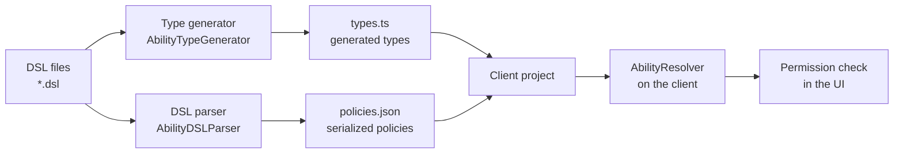

# @via-profit/ability - Server and client

[](https://www.npmjs.com/package/@via-profit/ability)
[](https://opensource.org/licenses/MIT)

Using `@via-profit/ability` in client-server applications.

> 📚 **Related documents:**
> - [Resolver](./resolver.md)
> - [Type generation](./types-generator.md)
> - [DSL](./dsl.md)

---

## Table of contents

- [General principle](#general-principle)
- [How it works](#how-it-works)
- [Server side](#server-side)
- [Client side](#client-side)
- [React integration](#react-integration)
    - [The `useAbility` hook](#the-useability-hook)
    - [The `AbilityGate` component](#the-abilitygate-component)
- [Usage scenarios](#usage-scenarios)
- [Frequently asked questions](#frequently-asked-questions)

---

## General principle

The key idea is that **all policies and TypeScript types are described and generated only on the server**. The client application receives ready-made policies as JSON and generated types in one of two ways:

1. **At build time** (recommended) — download artifacts through a script.
2. **At runtime** — request them from the server while initializing the application.

This approach guarantees a single source of truth: policies are stored only on the server.

## How it works



---

## Server side

### 1. Generating artifacts

Create a server script that generates types and serializes policies to JSON:

```typescript
// scripts/generate-ability-artifacts.ts
import fs from 'node:fs';
import path from 'node:path';
import { AbilityDSLParser, AbilityTypeGenerator, AbilityJSONParser } from '@via-profit/ability';

const dslPath = path.resolve('./src/ability');
const outputDir = path.resolve('./dist/ability');

// Collect all DSL files
const dslFiles = fs.readdirSync(dslPath).filter(f => f.endsWith('.dsl'));
let dsl = '';
for (const file of dslFiles) {
  dsl += fs.readFileSync(path.join(dslPath, file), 'utf-8') + '\n';
}

// Parse and generate
const policies = new AbilityDSLParser(dsl).parse();
const typeDefs = new AbilityTypeGenerator(policies).generateTypeDefs();

// Save artifacts
fs.writeFileSync(
  path.join(outputDir, 'types.ts'),
  typeDefs,
  { encoding: 'utf-8' }
);
fs.writeFileSync(
  path.join(outputDir, 'policies.json'),
  JSON.stringify(AbilityJSONParser.toJSON(policies)),
  { encoding: 'utf-8' }
);
```

### 2. HTTP server for artifacts (optional)

If you want to download artifacts on request, add an endpoint:

```typescript
// server/ability-artifacts.ts
import express from 'express';
import { AbilityDSLParser, AbilityTypeGenerator, AbilityJSONParser } from '@via-profit/ability';

const app = express();

app.get('/ability/artifacts', (req, res) => {
  const dsl = loadAllDSL(); // your DSL-loading logic
  const policies = new AbilityDSLParser(dsl).parse();
  const typeDefs = new AbilityTypeGenerator(policies).generateTypeDefs();

  res.json({
    ability: {
      policies: AbilityJSONParser.toJSON(policies),
      typeDefs,
    },
  });
});

app.listen(8005, () => {
  console.log('🌐 Ability artifacts server started on http://localhost:8005');
});
```

> [!NOTE]
> For more information about configuring the HTTP server, see [Resolver → Concept](./resolver.md#concept).

---

## Client side

### 1. Downloading artifacts

Create a script that downloads policies and types from the server:

```javascript
// scripts/download-ability.js
const path = require('node:path');
const fs = require('node:fs');

const downloadAbility = async () => {
  try {
    const response = await fetch('http://localhost:8005/ability/artifacts');
    
    if (!response.ok) {
      throw new Error(`HTTP ${response.status}: ${response.statusText}`);
    }
    
    const data = await response.json();
    const { policies, typeDefs } = data.ability;
    const abilityDir = path.resolve('./src/ability');

    if (!fs.existsSync(abilityDir)) {
      fs.mkdirSync(abilityDir, { recursive: true });
    }

    fs.writeFileSync(
      path.join(abilityDir, 'types.ts'),
      typeDefs,
      { encoding: 'utf-8' }
    );
    fs.writeFileSync(
      path.join(abilityDir, 'policies.json'),
      JSON.stringify(policies, null, 2),
      { encoding: 'utf-8' }
    );

    console.log('✅ Ability artifacts downloaded successfully');
  } catch (error) {
    console.error('❌ Ability downloading error:', error);
    process.exit(1);
  }
};

downloadAbility();
```

Add the script to `package.json`:

```json
{
  "scripts": {
    "download-ability": "node ./scripts/download-ability.js",
    "build": "npm run download-ability && npm run build:app"
  }
}
```

### 2. Client project structure

```text
src/
  ability/
    policies.json    # Downloaded policies (JSON)
    types.ts         # Generated types
    policies.ts      # Resolver initialization
```

### 3. Initializing the resolver on the client

```typescript
// src/ability/policies.ts
import { AbilityJSONParser, AbilityResolver, DenyOverridesStrategy } from '@via-profit/ability';
import policiesJSON from './policies.json';
import type { Resources, Environment, PolicyTags } from './types';

// Parse policies from JSON
export const policies = AbilityJSONParser.parse<Resources, Environment, PolicyTags>(policiesJSON);

// Create one resolver instance for the entire application
export const abilityResolver = new AbilityResolver(policies, DenyOverridesStrategy);

// Export types for convenience
export type { Resources, Environment, PolicyTags };
```

> [!IMPORTANT]
> JSON policies must be generated and parsed by the same package version. In JSON, rules store the `resourceType` flag (literal or path), and groups store the `isExcept` flag. After updating the package, regenerate `policies.json` on the server. Old-format JSON without `resourceType` is read by the previous rule: a string with a dot is treated as a path.

---

## React integration

### The `useAbility` hook

A hook for checking permissions in React components:

```tsx
// src/hooks/useAbility.ts
import * as React from 'react';
import {
  AbilityPolicy,
  ExtractEnvironmentByPermission,
  ExtractPermission,
} from '@via-profit/ability';
import { abilityResolver } from '~/ability/policies';
import { Environment, PolicyTags, Resources } from '~/ability/types';

type AppPolicy = AbilityPolicy<Resources, Environment, PolicyTags>;
type Permission = ExtractPermission<typeof abilityResolver>;
type Resource<P extends Permission> = P extends keyof Resources ? Resources[P] : never;
type EnvType<P extends Permission> = ExtractEnvironmentByPermission<AppPolicy, P>;

export const useAbility = <P extends Permission>(
  permission: P,
  resource: Resource<P>,
  env?: EnvType<P>,
) => {
  return React.useMemo(() => {
    const result = abilityResolver.resolve(permission, resource, env);

    return {
      isAllowed: result.isAllowed(),
      isDenied: result.isDenied(),
    };
  }, [permission, resource, env]);
};

export default useAbility;
```

### The `AbilityGate` component

A component for conditional rendering based on permissions:

```tsx
// src/components/AbilityGate.tsx
import * as React from 'react';
import { useAbility } from '~/hooks/useAbility';
import type { Resources, Environment, PolicyTags } from '~/ability/types';
import type {
  AbilityPolicy,
  ExtractEnvironmentByPermission,
  ExtractPermission,
} from '@via-profit/ability';
import { abilityResolver } from '~/ability/policies';

type AppPolicy = AbilityPolicy<Resources, Environment, PolicyTags>;
type Permission = ExtractPermission<typeof abilityResolver>;
type Resource<P extends Permission> = P extends keyof Resources ? Resources[P] : never;
type EnvType<P extends Permission> = ExtractEnvironmentByPermission<AppPolicy, P>;

export type AbilityGateProps<P extends Permission> = {
  /** Permission key */
  permission: P;
  /** Resource being checked */
  resource: Resource<P>;
  /** Environment data (optional) */
  env?: EnvType<P>;
  /** Content displayed when access is granted */
  children: React.ReactNode;
  /** Content displayed when access is denied */
  fallback?: React.ReactNode;
};

/**
 * Component for conditional rendering based on access permissions.
 */

export const AbilityGate = <P extends Permission>(props: AbilityGateProps<P>) => {
  const { permission, resource, env, children, fallback } = props;
  const { isAllowed } = useAbility(permission, resource, env);

  if (isAllowed) {
    return <>{children}</>;
  }

  if (fallback) {
    return fallback;
  }

  return null;
};

export default AbilityGate;
```

### Usage

#### With the `useAbility` hook

```tsx
import { useAbility } from '~/hooks/useAbility';
import { useUser } from '~/hooks/useUser';

export const UserProfile: React.FC<{ userId: string }> = ({ userId }) => {
  const user = useUser(userId);
  const { isDenied, isAllowed } = useAbility('user.update', { user });

  return (
    <div>
      <h1>{user.name}</h1>
      {isAllowed && (
        <button type="button" onClick={handleEdit}>
          Edit Profile
        </button>
      )}
      {isDenied && (
        <span className="text-gray-500">You cannot edit this profile</span>
      )}
    </div>
  );
};
```

#### With the `AbilityGate` component

```tsx
import { AbilityGate } from '~/components/AbilityGate';
import { useUser } from '~/hooks/useUser';

export const UserActions: React.FC<{ userId: string }> = ({ userId }) => {
  const user = useUser(userId);

  return (
    <div className="actions">
      {/* Simple variant */}
      <AbilityGate permission="user.update" resource={{ user }}>
        <button type="button" onClick={handleEdit}>
          Edit Profile
        </button>
      </AbilityGate>

      {/* With fallback */}
      <AbilityGate
        permission="user.delete"
        resource={{ user }}
        fallback={<span className="text-red-500">❌ No permission</span>}
      >
        <button type="button" className="danger" onClick={handleDelete}>
          Delete User
        </button>
      </AbilityGate>

      {/* With environment conditions */}
      <AbilityGate
        permission="document.publish"
        resource={{ document }}
        env={{ time: { hour: 14, minute: 30 } }}
        fallback={<span>⏰ Publishing available only during business hours</span>}
      >
        <button type="button" onClick={handlePublish}>
          Publish Document
        </button>
      </AbilityGate>
    </div>
  );
};
```

#### Complex example

```tsx
import { AbilityGate } from '~/components/AbilityGate';
import { useAbility } from '~/hooks/useAbility';

export const Dashboard: React.FC = () => {
  const user = useCurrentUser();
  const orders = useOrders();

  return (
    <div>
      <h1>Dashboard</h1>

      {/* Administration panel */}
      <AbilityGate permission="admin.view" resource={{ user }}>
        <AdminPanel />
      </AbilityGate>

      {/* Order list with different permissions */}
      {orders.map(order => (
        <OrderCard key={order.id} order={order}>
          <AbilityGate
            permission="order.update"
            resource={{ order }}
            fallback={<span className="text-gray-400">🔒</span>}
          >
            <button onClick={() => handleEdit(order)}>✏️ Edit</button>
          </AbilityGate>

          <AbilityGate
            permission="order.delete"
            resource={{ order }}
            fallback={null} // Hide the button completely
          >
            <button onClick={() => handleDelete(order)}>🗑️ Delete</button>
          </AbilityGate>
        </OrderCard>
      ))}

      {/* Using the hook for complex logic */}
      <OrderCreateSection />
    </div>
  );
};

const OrderCreateSection: React.FC = () => {
  const user = useCurrentUser();
  const { isAllowed } = useAbility('order.create', { user });

  if (!isAllowed) {
    return <div className="info">Contact admin to create orders</div>;
  }

  return <OrderForm />;
};
```

---

## Usage scenarios

### Scenario 1: preload (recommended)

```json
{
  "scripts": {
    "prebuild": "npm run download-ability",
    "build": "npm run prebuild && next build"
  }
}
```

Artifacts are downloaded **before** the application is built and included in the bundle.

### Scenario 2: dynamic loading

```typescript
// Load artifacts while initializing the application
async function initializeApp() {
  try {
    const response = await fetch('/api/ability/artifacts');
    const data = await response.json();
    
    // Store in global state
    setAbilityArtifacts(data);
  } catch (error) {
    console.error('Failed to load ability artifacts:', error);
  }
}
```

### Scenario 3: hybrid approach

```typescript
// Load artifacts while using a cache
async function getAbilityArtifacts() {
  const cached = localStorage.getItem('ability-artifacts');
  const cachedAt = localStorage.getItem('ability-artifacts-at');
  
  // If the cache is fresh (less than one hour old)
  if (cached && cachedAt && Date.now() - Number(cachedAt) < 3600000) {
    return JSON.parse(cached);
  }
  
  // Otherwise load from the server
  const response = await fetch('/api/ability/artifacts');
  const data = await response.json();
  
  localStorage.setItem('ability-artifacts', JSON.stringify(data));
  localStorage.setItem('ability-artifacts-at', String(Date.now()));
  
  return data;
}
```

---

## Frequently asked questions

### Can `@via-profit/ability` be used without a server?

Yes. If all policies are known when the client is built, you can generate artifacts locally and include them in the bundle.

### Can the client side be used without React?

Yes. Hooks and components are written for React, but the core logic (JSON parsing and the resolver) works in any JavaScript environment.

### Is it safe to send policies to the client?

Yes. Policies contain only access rules, not secret data. The actual check is still performed on the server during real operations.

### How can I test the client side with different permissions?

You can replace policies in tests or use a mock resolver.
