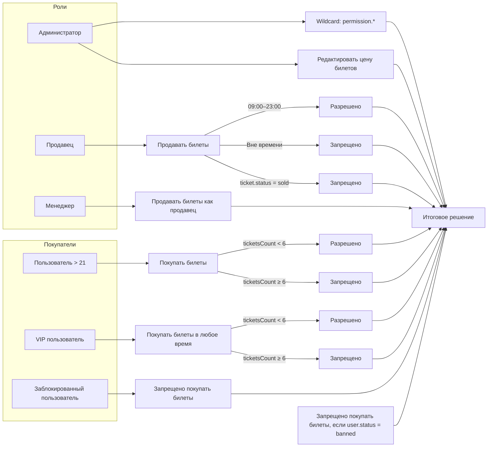

# @via-profit/Ability

> Набор сервисов, частично реализующих принцип [Attribute Based Access Control](https://en.wikipedia.org/wiki/Attribute-based_access_control)
> Пакет позволяет описывать правила, объединять их в группы, формировать политики и применять их к данным для определения разрешений.

## Language / Язык

- [🇬🇧 English](/docs/en/README.md)
- [🇷🇺 Русский](/docs/ru/README.md)

## Для чего

Пакет задуман как **лёгкая и предельно простая альтернатива** тяжёлым системам управления доступом.  
Без сложных конфигураций, без зависимостей — только минимальный набор инструментов, который позволяет описывать правила и политики в максимально простом DSL.

## Содержание

- [Быстрый старт](#быстрый-старт)
- [Основные положения](#основные-положения)
- [DSL](#dsl)
- [Объединение политик](#объединение-политик)
- [Environment политик](#environment-политик)
- [Генератор типов для TypeScript](#генератор-типов-для-typescript)
- [Отладка политик](#отладка-политик)
- [Решение проблем](#решение-проблем)
- [Рекомендации по проектированию](#рекомендации-по-проектированию)
- [Примеры](#примеры)
- [Производительность](#производительность)
- [Api-Reference](./api.md)


## Быстрый старт

Установить пакет, написать DSL, вызвать парсер, запустить резолвер.

### Установка

```bash
npm install @via-profit/ability
```

```bash
yarn add @via-profit/ability
```

```bash
pnpm add @via-profit/ability
```


### Пример: запретить доступ к `passwordHash` всем, кроме владельца

Допустим, у нас есть пользовательские данные:

```ts
const user = {
  id: '1',
  login: 'user-001',
  passwordHash: '...',
};
```

Нужно запретить чтение `passwordHash` всем, кроме самого пользователя.

#### DSL‑политика

На языке политик это выглядит так:

```
deny permission.user.passwordHash if any:
  viewer.id is not equals owner.id
```

**Пояснение:**

- `deny` — эффект политики (запретить доступ)
- `permission.user.passwordHash` — ключ разрешения.
- `if any:` — начало блока условий
- `viewer.id is not equals owner.id` — правило: если идентификатор запрашивающего не равен идентификатору владельца


Если `viewer.id` не равен `owner.id`, правило считается выполненным, и политика возвращает `deny` — доступ запрещён. Если же идентификаторы совпадают (т.е. пользователь запрашивает свои собственные данные), правило не срабатывает, и доступ разрешается.

_Замечание: Ключ разрешения формируется по принципу: `permission.` + ваш кастомный ключ в формате **dot notation**, например, ключ `foo.bar.baz` в DSL будет иметь вид `permission.foo.bar.baz`_

#### Проверка в коде

```ts
import { AbilityDSLParser, AbilityResolver } from '@via-profit/ability';

const dsl = `
deny permission.user.passwordHash if any:
  viewer.id is not equals owner.id
`;

const policies = new AbilityDSLParser(dsl).parse(); // получение политик
const resolver = new AbilityResolver(policies); // создание резолвера

resolver.enforce('user.passwordHash', {
  viewer: { id: '1' },
  owner: { id: '2' },
}); // выбросит ошибку — доступ запрещён
```
В `enforce` передаётся ключ без префикса `permission.` — он автоматически удаляется парсером.

## Основные положения

Тезисно перечислим основные положения, которые необходимо знать перед тем как начать пользоваться пакетом:

1. Резолвер (`AbilityResolver`) настроен по принципу `Default Deny`. Это значит, что если ни одна политика не сработала, то результат будет `deny` ([подробнее здесь](#решение-проблем)). Чтобы избежать неожиданного `deny`, убедитесь, что существует хотя бы одна `permit`‑политика, которая может совпасть. Только после этого добавляйте `deny`‑политики.
2. Политики применяются последовательно. Если несколько политик совпали, результат определяется последней совпавшей политикой.
3. Правила выполняются последовательно.
4. В группе правил (`RuleSet`) с оператором сравнения `all` дальнейшее выполнение правил прекращается как только первое же правило вернёт `mismatch`.
5. Для составления политик используйте [DSL](#dsl) — это проще и удобнее
6. Для хранения политик на сервере используйте JSON. Политики возможно экспортировать в JSON и импортировать из JSON
7. Чаще всего следует опираться на утверждение если разрешение не выдано явно → доступ запрещён.
8. Используйте встроенный кэш только в случаях, если ваши политики неимоверно сложны и содержат большое количество правил

### Модель взаимодействия

Сначала вы описываете "сырые" политики (SDL, JSON или при помощи классов). Затем из "сырых" данных вы формируете готовые политики (массив политик). Это делается один раз и позволяет иметь единый источник данных. Далее вы можете запускать проверку разрешений в нужных вам участках кода используя уже готовые политики и резолвер.

Политики, группы и правила можно создавать при помощи:

- DSL (Domain-Specific Language)
- Классов (классический подход)
- JSON

**Создание политик при помощи DSL**

```ts
import { AbilityDSLParser } from '@via-profit/ability';

// Описываем политики на языке Ability-DSL
const dsl = `
  # @name Создание заказа доступно только лицам старше 18 лет
  permit permission.order.action.create if all:
    all of:
      user.age gte 18

  # @name Редактирование стоимости доступно только администратору
  permit permission.order.data.price if all:
    all of:
      user.roles contains 'administrator'
`;

// Определяем типы ресурсов для TypeScript
// Типы можно генерировать автоматически (об этом позже), либо описывать вручную
// В данном примере, для простоты, типы описываются вручную
type Resources = {
  ['order.action.create']: {
    user: {
      age: number;
    }
  }
  ['order.data.price']: {
    user: {
      roles: string[];
    }
  }
}

// Для создания политик используем парсер
// В качестве дженерика передаем тип ресурсов
const policies = new AbilityDSLParser<Resources>(dsl).parse(); // AbilityPolicy[]

// Парсер вернёт массив политик даже
// если в DSL описана всего одна политика
console.log(policies); // [AbilityPolicy, AbilityPolicy, ...]

// экспортируем готовые политики
export default policies;
```

Более подробно про DSL смотри в разделе (DSL)[#dsl]

**Создание политик при помощи классаов (классический подход)**

Данный подход достаточно неповоротливый, но позволяет получить полный контроль над политиками

```ts
import { AbilityPolicy, AbilityRuleSet, AbilityRule, AbilityCompare, AbilityPolicyEffect } from '@via-profit/ability';

// Определяем типы ресурсов для TypeScript
// Типы можно генерировать автоматически (об этом позже), либо описывать вручную
// В данном примере, для простоты, типы описываются вручную
type Resources = {
  ['order.action.create']: {
    user: {
      age: number;
    }
  }
  ['order.data.price']: {
    user: {
      roles: string[];
    }
  }
}

const policies = [
  // первая политика
  new AbilityPolicy<Resources>({
    id: '1',
    name: 'Создание заказа доступно только лицам старше 18 лет',
    compareMethod: AbilityCompare.and,
    effect: AbilityPolicyEffect.permit,
    permission: 'order.action.create',
  }).addRuleSet(
    AbilityRuleSet.and([
      // правило
      AbilityRule.moreOrEqual('user.age', 18),
    ]),
  ),

  // вторая политика
  new AbilityPolicy<Resources>({
    id: '2',
    name: 'Редактирование стоимости доступно только администратору',
    compareMethod: AbilityCompare.and,
    effect: AbilityPolicyEffect.permit,
    permission: 'order.data.price',
  }).addRuleSet(
    AbilityRuleSet.and([
      // правило
      AbilityRule.contains('user.roles', 'administrator'),
    ])
  ),
];

// экспортируем готовые политики
export default policies;

```

**Создание политик при помощи JSON**

JSON позволяет хранить политики в файле или базе данных, например, в PostgreSQL, которая поддерживает работу с JSON-данными.

Классы политик, групп и правил имеют методы экспорта в JSON, таким образом, вы можете формировать политики любым способом и экспортировать их в JSON в любой момент когда вам это потребуется 

```ts
import { AbilityJSONParser } from '@via-profit/ability';

// Определяем типы ресурсов для TypeScript
// Типы можно генерировать автоматически (об этом позже), либо описывать вручную
// В данном примере, для простоты, типы описываются вручную
type Resources = {
  ['order.action.create']: {
    user: {
      age: number;
    }
  }
  ['order.data.price']: {
    user: {
      roles: string[];
    }
  }
}

// Парсим JSON используя AbilityJSONParser
// В качестве дженерика передаем типы ресурсов
const policies = AbilityJSONParser.parse<Resources>([
  {
    id: '1',
    name: 'Создание заказа доступно только лицам старше 18 лет',
    effect: 'permit',
    permission: 'order.action.create',
    compareMethod: 'and',
    ruleSet: [
      {
        compareMethod: 'and',
        rules: [
          {
            subject: 'user.age',
            resource: 18,
            condition: '>',
          }
        ]
      }
    ],
  },
  {
    id: '2',
    name: 'Редактирование стоимости доступно только администратору',
    effect: 'permit',
    permission: 'order.data.price',
    compareMethod: 'and',
    ruleSet: [
      {
        compareMethod: 'and',
        rules: [
          {
            subject: 'user.roles',
            resource: 'administrator',
            condition: 'contains',
          }
        ]
      }
    ]
  }
]);

export default policies;
```

---


## DSL

> DSL - Domain-Specific Language

Ability DSL — это декларативный язык для описания политик доступа.  
Он позволяет определять правила в человекочитаемой форме, используя простые конструкции: *политики*, *группы*, *правила* и *аннотации*.

### Структура политики

Политика состоит из:

```
<effect> <permission> if <all|any>:
  <group>...
```

Где:

- **effect** — `permit` или `deny`
- **permission** — строка вида `permission.foo.bar`, где суффикс `permission.` обязателен.
- **if all:** — все группы должны быть истинны
- **if any:** — хотя бы одна группа должна быть истинна

Политика может содержать одну или несколько групп правил.

Пример:

```dsl
permit permission.order.update if any:
  all of:
    user.roles contains 'admin'
    user.token is not null

  any of:
    user.roles contains 'developer'
    user.login is equals 'dev'
```

> Префикс `permission.` обязателен в DSL, но автоматически удаляется парсером. Внутри системы разрешение хранится как `order.update`.

Пример политики выше гласит - разрешение `permission.order.update` будет разрешено при выполнении одного из двух условий:
1. user.roles содержит 'admin' **и** user.token не null
2. user.roles содержит 'developer' **или** user.login равен 'dev'

### Ключ разрешения (permission key)

Ключ разрешения записываются в `dot notation` виде, но поддерживают возможность использования wildcard шаблонов при
помощи символа `*`. Это позволяет группировать ключи, а так же переопределять политики с похожими ключами.

Если под ключ подходит несколько политик, **выполняются все**. Итог определяется **последней совпавшей политикой**:


**Пример использования шаблонов**

| Политика (permission) | ключ                   | Совпадает |
|-------------------|------------------------|-----------|
| `order.*`         | `order.create`         | да |
| `order.*`         | `order.update`         | да |
| `order.*`         | `user.create`          | нет |
| `*.create`        | `order.create`         | да |
| `*.create`        | `user.create`          | да |
| `*.create`        | `order.update`         | нет |
| `user.profile.*`  | `user.profile.update`  | да |
| `user.profile.*`  | `user.settings.update` | нет |

**Пример политики с wildcard**
```ts
import { AbilityDSLParser, AbilityResolver } from '@via-profit/ability';

// DSL не полный и показан только ради примера
const dsl = `
permit permission.order.*
deny permission.order.update
`;

const policies = new AbilityDSLParser(dsl).parse();
const resolver = new AbilityResolver(policies);

await resolver.enforce('order.update', resource); // выбросит AbilityError

```

**Пояснение**

В DSL порядок политик имеет значение:
последняя совпавшая политика выигрывает.

Поэтому:

1. `permit` `permission.order.*` разрешает всё, что начинается с `order.`
2. `deny` `permission.order.update` перекрывает это разрешение.

Итог выполнения:

```
order.update → deny
order.create → permit
order.delete → permit
order.view   → permit
```


### Комментарии

Строки, начинающиеся с символа `#` считаются комментариями и не влияют на результат работы правил и политик.

---

### Аннотации

В настоящий момент поддерживается только одна аннотация ’name’, которая будет использована в качестве имени для политики, либо группы правил, либо правила.

Аннотации задаются через комментарии:

```
# @name <имя>
```

Аннотации применяются к **следующей сущности**:

- политике
- группе
- правилу

Пример:

```dsl
# @name can order update
permit permission.order.update if any:
  # @name authorized admin
  all of:
    # @name contains role admin
    user.roles contains 'admin'
```

---

### Группы правил

Группа определяет, как объединяются правила внутри неё:

```
all of:
  <rule>
  <rule>

any of:
  <rule>
  <rule>
```

- `all of:` — логическое AND
- `any of:` — логическое OR

`all of` - значит, что группа считается выполненной, если все правила внутри группы сработали.

`any of` - значит, что группа считается выполненной, если хотя бы одно правило внутри группы сработало.

Каждая группа внутри политики будет вычисляться независимо от других групп. Итоговая оценка результата будет определена путем сравнения результата вычисления всех групп в политике.


Группы могут иметь аннотации:

```dsl
# @name developer group
any of:
  user.roles contains 'developer'
```

---

### Правила

Правило — это атомарное условие внутри политики. Оно определяет, при каких данных политика будет считаться совпавшей. С помощью правил задаются условия по которым определяется эффективность политики (`permit` или `deny`)

Правило имеет форму:

```
<subject> <operator> <value?> — значение указывается не для всех операторов (например, is null не требует значения).
```

#### Subject (субъект)

Идентификатор в dot‑нотации:

```
user.roles
env.time.hour
order.total
```

#### Operators (операторы)

_Синонимы — это альтернативные формы записи, которые также поддерживаются парсером._

**Базовые операторы сравнения**

| Оператор DSL | Синонимы | Пример | Описание | Типы |
|--------------|----------|--------|----------|------|
| **is equals** | `=`, `==`, `equals` | `age is equals 18` | Строгое равенство | number, string, boolean |
| **is not equals** | `!=`, `<>`, `not equals` | `role is not equals 'admin'` | Строгое неравенство | number, string, boolean |
| **greater than** | `>`, `gt` | `age greater than 18` | Больше | number, date |
| **greater than or equal** | `>=`, `gte` | `age greater than or equal 18` | Больше или равно | number, date |
| **less than** | `<`, `lt` | `age less than 18` | Меньше | number, date |
| **less than or equal** | `<=`, `lte` | `age less than or equal 18` | Меньше или равно | number, date |


**Null‑операторы**

| Оператор DSL | Синонимы | Пример | Описание | Типы |
|--------------|----------|--------|----------|------|
| **is null** | `== null`, `= null` | `middleName is null` | Значение отсутствует | any |
| **is not null** | `!= null` | `middleName is not null` | Значение присутствует | any |

**Операторы для списков (массивов)**

| Оператор DSL | Синонимы                  | Пример | Описание | Типы |
|--------------|---------------------------|--------|----------|------|
| **in [...]** | -                         | `role in ['admin', 'manager']` | Значение входит в список | number, string |
| **not in [...]** | -                         | `role not in ['banned']` | Значение не входит | number, string |
| **contains** | `includes`, `has`         | `tags contains 'vip'` | Массив содержит элемент | array |
| **not contains** | `not includes`, `not has` | `tags not contains 'vip'` | Массив не содержит элемент | array |


**Строковые операторы**

| Оператор DSL | Синонимы | Пример | Описание | Типы |
|--------------|----------|--------|----------|------|
| **starts with** | `begins with` | `email starts with 'admin@'` | Строка начинается с | string |
| **not starts with** | — | `email not starts with 'test'` | Строка не начинается с | string |
| **ends with** | — | `email ends with '.ru'` | Строка заканчивается на | string |
| **not ends with** | — | `email not ends with '.com'` | Строка не заканчивается на | string |
| **includes** | `contains substring` | `name includes 'lex'` | Строка содержит подстроку | string |
| **not includes** | — | `name not includes 'test'` | Строка не содержит подстроку | string |

**Булевые операторы**

| Оператор DSL | Синонимы | Пример | Описание | Типы |
|--------------|----------|--------|----------|------|
| **is true** | `= true` | `isActive is true` | Значение истинно | boolean |
| **is false** | `= false` | `isActive is false` | Значение ложно | boolean |

**Операторы длины**

| Оператор DSL | Синонимы | Пример | Описание | Типы |
|--------------|----------|--------|----------|------|
| **length equals** | `len =` | `tags length equals 3` | Длина равна | array, string |
| **length greater than** | `len >` | `tags length greater than 2` | Длина больше | array, string |
| **length less than** | `len <` | `tags length less than 5` | Длина меньше | array, string |

#### Value (значение)

Поддерживаются:

- строки `'text'`
- числа `42`
- булевы `true` / `false`
- `null`
- массивы `[1, 2, 3]` / `['foo', false, null, 1, 2, '999']`

Примеры:

```dsl
# возраст пользователя больше 18
user.age greater than 18

# массив ролей содержит роль 'admin'
user.roles contains 'admin'

# тэг заказа либо 'vip', либо 'priority'
order.tag in ['vip', 'priority']

# токен пользователя не null
user.token is not null

# логин пользователя длиннее 12 символов
user.login length greater than 12
```


---

### Неявная группа (implicit group)

Если правила идут без `all of:` или `any of:`, они объединяются оператором политики:

```dsl
permit permission.order.update if all:
  user.roles contains 'admin'
  user.token is not null
```

Эквивалентно:

```dsl
permit permission.order.update if all:
  all of:
    user.roles contains 'admin'
    user.token is not null
```

Неявная группа всегда соответствует оператору политики (`if all` или `if any`).

---

### Полный пример

```dsl
# @name разрешено обновление заказа
permit permission.order.update if any:

  # @name если это администратор
  all of:
    user.roles contains 'admin'
    user.token is not null

  # @name если это разработчик
  any of:
    user.roles contains 'developer'
    user.login is equals 'dev'
```


## Объединение политик

В реальном проекте следует использовать несколько политик сразу

TODO: использование нескольких политик

## Environment политик

**Environment** — это объект, содержащий данные окружения, которые не принадлежат ни пользователю, ни ресурсу.
Содержимое объекта определяется разработчиком и может быть любым объектом состоящим из примитивов.

- время запроса,
- IP‑адрес,
- параметры устройства,
- заголовки запроса,
- контекст сессии,
- любые другие внешние условия.

Environment передаётся в `resolve()` и `enforce()` как третий аргумент:

```ts
const environment = {
  time: {
    hour: new Date().getHours(),
  },
  ip: req.ip,
}

await resolver.enforce('order.update', resource, environment);
```

### Использование environment в правилах

В политике можно ссылаться на environment через путь `env.*`.

Пример политики, которая запрещает обновление заказов ночью (22:00–06:00).:

```dsl
# @name Deny updates at night
deny permission.order.update if all:
  env.time.hour less than 6 
  env.time.hour greater or equal than 22
```

**Извлечение значений из environment**

Если в правиле указан путь:

- `env.*` → значение берётся из environment
- `user.*`, `order.*`, `profile.*` → из resource
- литерал (`18`, `"admin"`, `true`) → используется как есть

Пример:

```ts
subject: "env.geo.country"
resource: "user.country"
condition: "equal"
```

### Environment в TypeScript

Тип Environment задаётся на уровне `AbilityResolver`:

```ts
const resolver = new AbilityResolver<Resources, Environment>(policies);
```

Это позволяет:

- получать автодополнение в IDE,
- проверять корректность путей `env.*`,
- избегать ошибок при передаче environment.

> Если правило использует `env.*`, но environment не передан, то значение `env.*` будет `undefined`, и сравнение будет выполнено так, как если бы environment не было вовсе


## Генератор типов для TypeScript

`AbilityParser.generateTypeDefs()` генерирует типы для TypeScript на основе политик, что позволяет не беспокоиться о расхождении между типами и данными в политиках.

**Пример использования**

Сначала необходимо подготовить массив политик. Политики можно хранить в DSL или в JSON и парсить их в массив готовых политик. В данном примере, для наглядности, политики хранятся в DSL.

```ts
// scripts/policies.ts

import { AbilityDSLParser } from '@via-profit/ability';

const dsl = `
# @name Update order
permit permission.order.update if all:

  # @name Owner check
  all of:
    # @name User is owner
    user.id = order.ownerId
`;

const policies = new AbilityDSLParser(dsl).parse();

export default policies;
```

```ts
// scripts/generate-types.ts
import { writeFileSync } from 'node:fs';
import { AbilityParser } from '@via-profit/ability';
import policies from './policies.json';

const typedefs = AbilityParser.generateTypeDefs(policies);

writeFileSync('./src/ability/types.generated.ts', typedefs, 'utf8');
```

**Сгенерированный файл (пример)**

```ts
// src/ability/types.generated.ts

// Automatically generated by via-profit/ability
// Do not edit manually
export type Resources = {
  'order.update': {
    readonly user: {
      readonly id: string;
    };
    readonly order: {
      readonly ownerId: string;
    };
  };
};
```

**Использование в коде**

```ts
import { AbilityResolver, AbilityPolicy } from '@via-profit/ability';
import type { Resources } from './ability/types.generated';

const resolver = new AbilityResolver<Resources>(
  AbilityPolicy.parseAll(policies),
);

await resolver.enforce('order.update', {
  user: { id: 'u1' },
  order: { ownerId: 'u1' },
});
```

## Отладка политик

### Объяснения

Для упрощения отладки политик применяется специальный класс `AbilityResult`, который уже включён в итоговый результат вычислений. `AbilityResult` инкапсулирует итог применения всех подходящих политик к ключу разрешений и ресурсу.

`AbilityResult` содержит:

- список проверенных политик,
- методы для определения итогового эффекта,
- методы для получения объяснений в текстовом представлении.

Пример:

```ts
const result = await resolver.resolve('order.update', resource);

if (result.isDenied()) {
  console.log('Access denied');
}

const explanations = result.explain(); // AbilityExplain

// console.log(explanations.toString());
```

### AbilityExplain

`AbilityExplain` и связанные классы (`AbilityExplainPolicy`, `AbilityExplainRuleSet`, `AbilityExplainRule`) позволяют получить человекочитаемое объяснение:

- какая политика сработала,
- какие группы правил совпали,
- какие правила не прошли,
- какой эффект был применён.

Пример использования:

```ts
const result = await resolver.resolve('order.update', resource);
const explanations = result.explain();

console.log(explanations.toString());
```

Пример вывода:

```
✓ policy «Запрет обновления заказа для менеджеров» is match
  ✓ ruleSet «Менеджеры» is match
    ✓ rule «Отдел managers» is match
    ✗ rule «Роль manager» is mismatch
  ✓ ruleSet «Не администраторы» is match
    ✓ rule «Нет роли administrator» is match
```

### Формат вывода

В настоящий момент поддерживается только один формат вывода - текстовый.

Вывод строится по принципу: <policy | ruleSet | rule > <название> <is match | is mismatch>


## Решение проблем

### Модель принятия решений (Default Deny)

> Почему политика `deny` не превращается в `permit`, если её условия не выполнены?

Рассмотрим политику, которая **запрещает** доступ пользователю с возрастом 16 лет:

```ts
const dsl = `
deny permission.test if all:
  user.age is equals 16
`;

const policies = new AbilityDSLParser(dsl).parse();
const resolver = new AbilityResolver(policies);

const result = await resolver.resolve('test', {
  user: { age: 16 },
});

console.log(result.isDenied());  // true  ✔
console.log(result.isAllowed()); // false ✔
```

В этом случае всё очевидно:  
условие выполнено → политика совпала → эффект `deny` → доступ запрещён.

**Что происходит, если условия `не выполнены`?**

```ts
const result = await resolver.resolve('test', {
  user: { age: 12 },
});

console.log(result.isDenied());  // true  ✔
console.log(result.isAllowed()); // false ✔
```

На первый взгляд может показаться, что если условие не выполнено, то политика должна «разрешить» доступ.  
Но это **не так**.

**Модель принятия решений: `Default Deny`**

`AbilityResolver` использует классическую модель безопасности:

> **Если нет ни одной совпавшей permit‑политики → доступ запрещён.**

**Что происходит в данном примере:**

1. Политика `deny` существует, но её условие **не выполнено**  
   → политика получает статус `mismatch`.

2. Политика `deny` **не применяется**, потому что условия не совпали.

3. Политики `permit` **нет**.

4. Раз нет ни одной разрешающей политики → итоговое решение:  
   **deny (по умолчанию)**.


**Итог**

- `deny` с совпавшими условиями → **deny**
- `deny` с несовпавшими условиями → **deny (default deny)**
- `permit` с совпавшими условиями → **allow**
- `permit` с несовпавшими условиями → **deny (default deny)**

**Заключение**

**Доступ разрешается только при наличии явного permit.**

## Рекомендации по проектированию

### Именование ключей доступа

- Используйте иерархические ключи: `permission.order.create`, `permission.order.update.status`, `permission.user.profile.update`.
- Группируйте по доменам: `permission.user.*`, `permission.order.*`, `permission.product.*`.
- Не смешивайте разные домены в одном ключе.

### Структура данных

- Явно описывайте `Resources` в TypeScript.
- Не передавайте «лишние» поля — это усложняет понимание.
- Старайтесь, чтобы структура данных для одного `permission` была стабильной.

### Проектирование политик

- Общие правила — через wildcard (`permission.order.*`).
- Специфичные ограничения — через точные действия (`permission.order.update`).
- Для запретов используйте `effect: deny`.
- Для разрешений — `effect: permit`.

### Типичные ошибки

- Ожидание, что отсутствие совпавших политик означает deny.
- Смешивание бизнес-логики и политик доступа.
- Слишком крупные политики с десятками правил — лучше разбивать.

### Пример использования на фронтенде (React)

**Хук для проверки политик**

```tsx
// hooks/use-ability.ts
import { useEffect, useState } from 'react';
import { AbilityResolver } from '@via-profit/ability';
import { Resources } from './generated-types';

export function useAbility<Permission extends keyof Resources>(
  resolver: AbilityResolver<Resources>,
  permission: Permission,
  resource: Resources[Permission],
) {
  const [allowed, setAllowed] = useState<boolean | null>(null);

  useEffect(() => {
    let cancelled = false;

    async function check() {
      try {
        const result = await resolver.resolve(permission, resource);
        if (!cancelled) {
          setAllowed(result.isAllowed());
        }
      } catch {
        if (!cancelled) {
          setAllowed(false);
        }
      }
    }

    check();

    return () => {
      cancelled = true;
    };
  }, [resolver, permission, resource]);

  return allowed;
}
```

**Использование в компоненте**

```tsx
function OrderUpdateButton({ order, user }) {
  const allowed = useAbility(resolver, 'order.update', {
    user,
    order,
  });

  if (allowed === null) {
    return null; // или бейдж загрузки
  }

  if (!allowed) {
    return null;
  }

  return <button>Update order</button>;
}
```


## Примеры


### Пример сложной многоступенчатой политики

Ниже - многоступенчатый набор политик, на примере использования в кинотеатре (выдуманный пример).

**Пример демонстрирует:**
- работу с ролями (admin, seller, manager, VIP, banned),
- временн́ые ограничения (`env.time.hour`),
- wildcard‑права (`permission.*`),
- ограничения по количеству билетов,
- запрет на продажу уже проданных билетов,
- комбинацию `permit`/`deny`‑политик,
- приоритет политик и модель Default Deny.


**Краткое описание правил**
- **Администратор**  
  Имеет wildcard‑права (`permission.*`) и может выполнять любые действия.  
  Может редактировать стоимость билетов.

- **Продавец**  
  Может продавать билеты только в рабочие часы (09:00–23:00).  
  Не может продавать билеты, если:
    - кинотеатр закрыт,
    - билет уже продан.

- **Менеджер**  
  Имеет те же права, что и продавец.

- **Покупатели**
    - Пользователь старше 21 года может покупать билеты.
    - VIP‑пользователь может покупать билеты в любое время.
    - Заблокированный пользователь (`status = banned`) не может покупать билеты.
    - Любой пользователь не может купить более 6 билетов.


**Общая диаграмма политик**



**DSL политик**

```dsl
############################################################
# @name Admin can edit ticket price
permit permission.ticket.price.edit if all:
  user.role is equals 'admin'


############################################################
# @name Seller can sell tickets during working hours
permit permission.ticket.sell if all:
  user.role is equals 'seller'
  all of:
    env.time.hour greater than or equal 9
    env.time.hour less than or equal 23


############################################################
# @name Users older than 21 can buy tickets
permit permission.ticket.buy if all:
  user.age greater than 21


############################################################
# @name VIP users can buy tickets anytime
permit permission.ticket.buy if all:
  user.isVIP is true


############################################################
# @name Deny buying tickets if user is banned
deny permission.ticket.buy if all:
  user.status is equals 'banned'


############################################################
# @name Deny selling tickets if cinema is closed
deny permission.ticket.sell if all:
  any of:
    env.time.hour less than 9
    env.time.hour greater than 23


############################################################
# @name Manager can do everything seller can
permit permission.ticket.sell if all:
  user.role is equals 'manager'


############################################################
# @name Admin wildcard permissions
permit permission.* if all:
  user.role is equals 'admin'


############################################################
# @name Limit tickets per user (max 6)
deny permission.ticket.buy if all:
  user.ticketsCount greater than or equal 6


############################################################
# @name Cannot sell already sold tickets
deny permission.ticket.sell if all:
  ticket.status is equals 'sold'

```


Ниже показано, как использовать приведённые выше политики в Node.js + TypeScript.

**Подготовка политик**

```ts
import { AbilityDSLParser } from '@via-profit/ability';
import cinemaDSL from './policies/cinema.dsl';

export const policies = new AbilityDSLParser(cinemaDSL).parse();
```

**Создание резолвера**

```ts
import { AbilityResolver } from '@via-profit/ability';
import { policies } from './policies';

const resolver = new AbilityResolver(policies);
```

**Проверка разрешений (enforce)**

Пример: покупка билета.

Метод enforce выбрасывает исключение `AbilityError`, если доступ запрещён.

```ts
await resolver.enforce('ticket.buy', {
  user: { age: 25, ticketsCount: 1 },
  env: { time: { hour: 18 } },
});

```
Если разрешено — код продолжит выполнение.
Если запрещено — будет выброшено исключение `AbilityError`.


**Проверка разрешений без исключений (resolve)**

`resolve` возвращает объект результата:

```ts
const result = await resolver.resolve('ticket.buy', {
  user: { age: 25, ticketsCount: 1 },
  env: { time: { hour: 18 } },
});

if (result.isAllowed()) {
  console.log('Покупка разрешена');
} else {
  console.log('Покупка запрещена');
}

```

**Продавец может продавать только в рабочие часы***

```ts
await resolver.enforce('ticket.sell', {
  user: { role: 'seller' },
  env: { time: { hour: 15 } },
  ticket: { status: 'available' },
});

```

**Подготовка данных для резолвера**

В примерах выше в резолвер передаются простые константные объекты:

```ts
resolver.enforce('ticket.buy', {
  user: { age: 25 },
  env: { time: { hour: 18 } },
});
```

Это сделано для наглядности. В реальном приложении данные для резолвера должны формироваться динамически — из тех источников, которые доступны вашему серверу.

**Пользователь** (`user`) обычно берётся из:


- JWT‑токена
- сессии
- базы данных
- middleware авторизации

Пример:

```ts
const user = await db.users.findById(session.userId);
```

**Окружение (Environment)** (`env`)

Это любые внешние параметры, которые могут влиять на доступ:

- текущее время сервера
- часовой пояс
- IP‑адрес
- заголовки запроса
- конфигурация системы

Пример:

```ts
const env = {
  time: {
    hour: new Date().getHours(),
  },
  ip: req.ip,
};
```

**Ресурс** (например, `ticket`)

Если действие связано с конкретным объектом — его тоже нужно загрузить:

```ts
const ticket = await db.tickets.findById(req.params.ticketId);
```

**Контекст**

Контекст — это объект, который вы передаёте в `resolve` или `enforce`.  
Он содержит **все данные**, которые могут понадобиться политикам:

- `user` — данные о текущем пользователе
- `env` — данные окружения (время, IP, география, настройки системы)
- `resource` или `ticket` — данные о сущности, над которой выполняется действие
- любые другие объекты, которые вы используете в DSL

**Важно понимать:**

> Контекст формируется под конкретное действие и конкретные политики. Его не нужно хранить заранее — вы собираете его динамически перед вызовом резолвера.


## Производительность

В тестах задействовались политики на 10 условий, вложенные поля, environment.

**Tinybench** ([https://github.com/tinylibs/tinybench](https://github.com/tinylibs/tinybench))

| # | Task name                              | Latency avg (ns)      | Latency med (ns)      | Throughput avg (ops/s) | Throughput med (ops/s) | Samples |
|---|-----------------------------------------|------------------------|------------------------|--------------------------|--------------------------|---------|
| 0 | resolve() — no cache (heavy rules)      | 646317 ± 0.32%         | 632319 ± 8446.0        | 1555 ± 0.21%             | 1581 ± 21                | 3095    |
| 1 | resolve() — cold cache (heavy rules)    | 636363 ± 0.38%         | 623092 ± 7885.0        | 1581 ± 0.21%             | 1605 ± 20                | 3143    |
| 2 | resolve() — warm cache (heavy rules)    | 631328 ± 0.26%         | 621152 ± 6562.5        | 1590 ± 0.17%             | 1610 ± 17                | 3168    |

```
Latency (ns)
650k | ███████████████████████████████████████ resolve() — no cache
640k | █████████████████████████████████████ resolve() — cold cache
630k | ████████████████████████████████████ resolve() — warm cache
      --------------------------------------------------------------
        no cache            cold cache            warm cache
```

```
Throughput (ops/s)
1600 | ███████████████████████████████████████ resolve() — warm cache
1590 | ██████████████████████████████████████ resolve() — cold cache
1580 | █████████████████████████████████████ resolve() — no cache
      --------------------------------------------------------------
        no cache            cold cache            warm cache

```


## Лицензия

Этот проект лицензирован под лицензией MIT. Подробности в файле [LICENSE](LICENSE).
