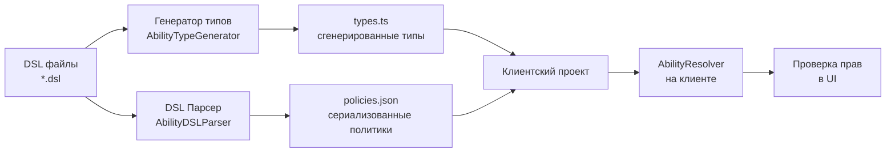

# @via-profit/ability - Сервер и клиент

[](https://www.npmjs.com/package/@via-profit/ability)
[](https://opensource.org/licenses/MIT)

Использование `@via-profit/ability` в клиент-серверных приложениях.

> 📚 **Связанные документы:**
> - [Резолвер](./resolver.md)
> - [Генерация типов](./types-generator.md)
> - [DSL](./dsl.md)

---

## Содержание

- [Общий принцип](#общий-принцип)
- [Схема работы](#схема-работы)
- [Серверная часть](#серверная-часть)
- [Клиентская часть](#клиентская-часть)
- [Интеграция с React](#интеграция-с-react)
    - [Хук `useAbility`](#хук-useability)
    - [Компонент `AbilityGate`](#компонент-abilitygate)
- [Сценарии использования](#сценарии-использования)
- [Частые вопросы](#частые-вопросы)

---

## Общий принцип

Ключевая идея: **все политики и TypeScript типы описываются и формируются только на сервере**. Клиентское приложение получает готовые политики в виде JSON и сгенерированные типы одним из двух способов:

1. **Во время сборки** (рекомендуемый) — скачивание артефактов через скрипт
2. **В рантайме** — запрос к серверу при инициализации приложения

Такой подход гарантирует единый источник истины - политики хранятся только на сервере. 

## Схема работы



---

## Серверная часть

### 1. Генерация артефактов

На сервере создается скрипт, который генерирует типы и сериализует политики в JSON:

```typescript
// scripts/generate-ability-artifacts.ts
import fs from 'node:fs';
import path from 'node:path';
import { AbilityDSLParser, AbilityTypeGenerator, AbilityJSONParser } from '@via-profit/ability';

const dslPath = path.resolve('./src/ability');
const outputDir = path.resolve('./dist/ability');

// Собираем все DSL файлы
const dslFiles = fs.readdirSync(dslPath).filter(f => f.endsWith('.dsl'));
let dsl = '';
for (const file of dslFiles) {
  dsl += fs.readFileSync(path.join(dslPath, file), 'utf-8') + '\n';
}

// Парсим и генерируем
const policies = new AbilityDSLParser(dsl).parse();
const typeDefs = new AbilityTypeGenerator(policies).generateTypeDefs();

// Сохраняем артефакты
fs.writeFileSync(
  path.join(outputDir, 'types.ts'),
  typeDefs,
  { encoding: 'utf-8' }
);
fs.writeFileSync(
  path.join(outputDir, 'policies.json'),
  JSON.stringify(AbilityJSONParser.toJSON(policies)),
  { encoding: 'utf-8' }
);
```

### 2. HTTP-сервер для артефактов (опционально)

Если вы хотите скачивать артефакты по запросу, добавьте эндпоинт:

```typescript
// server/ability-artifacts.ts
import express from 'express';
import { AbilityDSLParser, AbilityTypeGenerator, AbilityJSONParser } from '@via-profit/ability';

const app = express();

app.get('/ability/artifacts', (req, res) => {
  const dsl = loadAllDSL(); // ваша логика загрузки DSL
  const policies = new AbilityDSLParser(dsl).parse();
  const typeDefs = new AbilityTypeGenerator(policies).generateTypeDefs();

  res.json({
    ability: {
      policies: AbilityJSONParser.toJSON(policies),
      typeDefs,
    },
  });
});

app.listen(8005, () => {
  console.log('🌐 Ability artifacts server started on http://localhost:8005');
});
```

> [!NOTE]
> Подробнее о настройке HTTP-сервера смотрите в разделе [Резолвер → Концепция](./resolver.md#концепция).

---

## Клиентская часть

### 1. Скачивание артефактов

Создайте скрипт для скачивания политик и типов с сервера:

```javascript
// scripts/download-ability.js
const path = require('node:path');
const fs = require('node:fs');

const downloadAbility = async () => {
  try {
    const response = await fetch('http://localhost:8005/ability/artifacts');
    
    if (!response.ok) {
      throw new Error(`HTTP ${response.status}: ${response.statusText}`);
    }
    
    const data = await response.json();
    const { policies, typeDefs } = data.ability;
    const abilityDir = path.resolve('./src/ability');

    if (!fs.existsSync(abilityDir)) {
      fs.mkdirSync(abilityDir, { recursive: true });
    }

    fs.writeFileSync(
      path.join(abilityDir, 'types.ts'),
      typeDefs,
      { encoding: 'utf-8' }
    );
    fs.writeFileSync(
      path.join(abilityDir, 'policies.json'),
      JSON.stringify(policies, null, 2),
      { encoding: 'utf-8' }
    );

    console.log('✅ Ability artifacts downloaded successfully');
  } catch (error) {
    console.error('❌ Ability downloading error:', error);
    process.exit(1);
  }
};

downloadAbility();
```

Добавьте скрипт в `package.json`:

```json
{
  "scripts": {
    "download-ability": "node ./scripts/download-ability.js",
    "build": "npm run download-ability && npm run build:app"
  }
}
```

### 2. Структура клиентского проекта

```text
src/
  ability/
    policies.json    # Скачанные политики (JSON)
    types.ts         # Сгенерированные типы
    policies.ts      # Инициализация резолвера
```

### 3. Инициализация резолвера на клиенте

```typescript
// src/ability/policies.ts
import { AbilityJSONParser, AbilityResolver, DenyOverridesStrategy } from '@via-profit/ability';
import policiesJSON from './policies.json';
import type { Resources, Environment, PolicyTags } from './types';

// Парсим политики из JSON
export const policies = AbilityJSONParser.parse<Resources, Environment, PolicyTags>(policiesJSON);

// Создаем резолвер (один инстанс на всё приложение)
export const abilityResolver = new AbilityResolver(policies, DenyOverridesStrategy);

// Экспортируем типы для удобства
export type { Resources, Environment, PolicyTags };
```

---

## Интеграция с React

### Хук `useAbility`

Хук для проверки прав в React-компонентах:

```tsx
// src/hooks/useAbility.ts
import * as React from 'react';
import {
  AbilityPolicy,
  ExtractEnvironmentByPermission,
  ExtractPermission,
} from '@via-profit/ability';
import { abilityResolver } from '~/ability/policies';
import { Environment, PolicyTags, Resources } from '~/ability/types';

type AppPolicy = AbilityPolicy<Resources, Environment, PolicyTags>;
type Permission = ExtractPermission<typeof abilityResolver>;
type Resource<P extends Permission> = P extends keyof Resources ? Resources[P] : never;
type EnvType<P extends Permission> = ExtractEnvironmentByPermission<AppPolicy, P>;

export const useAbility = <P extends Permission>(
  permission: P,
  resource: Resource<P>,
  env?: EnvType<P>,
) => {
  return React.useMemo(() => {
    const result = abilityResolver.resolve(permission, resource, env);

    return {
      isAllowed: result.isAllowed(),
      isDenied: result.isDenied(),
    };
  }, [permission, resource, env]);
};

export default useAbility;

```

### Компонент `AbilityGate`

Компонент для условного рендеринга на основе прав:

```tsx
// src/components/AbilityGate.tsx
import * as React from 'react';
import { useAbility } from '~/hooks/useAbility';
import type { Resources, Environment, PolicyTags } from '~/ability/types';
import type {
  AbilityPolicy,
  ExtractEnvironmentByPermission,
  ExtractPermission,
} from '@via-profit/ability';
import { abilityResolver } from '~/ability/policies';

type AppPolicy = AbilityPolicy<Resources, Environment, PolicyTags>;
type Permission = ExtractPermission<typeof abilityResolver>;
type Resource<P extends Permission> = P extends keyof Resources ? Resources[P] : never;
type EnvType<P extends Permission> = ExtractEnvironmentByPermission<AppPolicy, P>;

export type AbilityGateProps<P extends Permission> = {
  /** Ключ разрешения */
  permission: P;
  /** Проверяемый ресурс */
  resource: Resource<P>;
  /** Данные окружения (опционально) */
  env?: EnvType<P>;
  /** Контент, который отображается при наличии доступа */
  children: React.ReactNode;
  /** Контент, который отображается при отсутствии доступа */
  fallback?: React.ReactNode;
};

/**
 * Компонент для условного рендеринга на основе прав доступа
*/

const AbilityGate = <P extends Permission>(props: Props<P>) => {
  const { permission, resource, env, children, fallback } = props;
  const { isAllowed } = useAbility(permission, resource, env);

  if (isAllowed === null) {
    return null;
  }

  if (isAllowed) {
    return <>{children}</>;
  }

  if (fallback) {
    return fallback;
  }

  return null;
};

export default AbilityGate;
```

### Использование

#### С хуком `useAbility`

```tsx
import { useAbility } from '~/hooks/useAbility';
import { useUser } from '~/hooks/useUser';

export const UserProfile: React.FC<{ userId: string }> = ({ userId }) => {
  const user = useUser(userId);
  const { isDenied, isAllowed } = useAbility('user.update', { user });

  return (
    <div>
      <h1>{user.name}</h1>
      {isAllowed && (
        <button type="button" onClick={handleEdit}>
          Edit Profile
        </button>
      )}
      {isDenied && (
        <span className="text-gray-500">You cannot edit this profile</span>
      )}
    </div>
  );
};
```

#### С компонентом `AbilityGate`

```tsx
import { AbilityGate } from '~/components/AbilityGate';
import { useUser } from '~/hooks/useUser';

export const UserActions: React.FC<{ userId: string }> = ({ userId }) => {
  const user = useUser(userId);

  return (
    <div className="actions">
      {/* Простой вариант */}
      <AbilityGate permission="user.update" resource={{ user }}>
        <button type="button" onClick={handleEdit}>
          Edit Profile
        </button>
      </AbilityGate>

      {/* С fallback */}
      <AbilityGate
        permission="user.delete"
        resource={{ user }}
        fallback={<span className="text-red-500">❌ No permission</span>}
      >
        <button type="button" className="danger" onClick={handleDelete}>
          Delete User
        </button>
      </AbilityGate>

      {/* С условиями окружения */}
      <AbilityGate
        permission="document.publish"
        resource={{ document }}
        env={{ time: { hour: 14, minute: 30 } }}
        fallback={<span>⏰ Publishing available only during business hours</span>}
      >
        <button type="button" onClick={handlePublish}>
          Publish Document
        </button>
      </AbilityGate>
    </div>
  );
};
```

#### Комплексный пример

```tsx
import { AbilityGate } from '~/components/AbilityGate';
import { useAbility } from '~/hooks/useAbility';

export const Dashboard: React.FC = () => {
  const user = useCurrentUser();
  const orders = useOrders();

  return (
    <div>
      <h1>Dashboard</h1>

      {/* Админская панель */}
      <AbilityGate permission="admin.view" resource={{ user }}>
        <AdminPanel />
      </AbilityGate>

      {/* Список заказов с разными правами */}
      {orders.map(order => (
        <OrderCard key={order.id} order={order}>
          <AbilityGate
            permission="order.update"
            resource={{ order }}
            fallback={<span className="text-gray-400">🔒</span>}
          >
            <button onClick={() => handleEdit(order)}>✏️ Edit</button>
          </AbilityGate>

          <AbilityGate
            permission="order.delete"
            resource={{ order }}
            fallback={null} // Скрываем кнопку полностью
          >
            <button onClick={() => handleDelete(order)}>🗑️ Delete</button>
          </AbilityGate>
        </OrderCard>
      ))}

      {/* Использование хука для сложной логики */}
      <OrderCreateSection />
    </div>
  );
};

const OrderCreateSection: React.FC = () => {
  const user = useCurrentUser();
  const { isAllowed } = useAbility('order.create', { user });

  if (!isAllowed) {
    return <div className="info">Contact admin to create orders</div>;
  }

  return <OrderForm />;
};
```

---

## Сценарии использования

### Сценарий 1: Предварительная загрузка (рекомендуемый)

```json
{
  "scripts": {
    "prebuild": "npm run download-ability",
    "build": "npm run prebuild && next build"
  }
}
```

Артефакты скачиваются **до сборки** приложения и включаются в бандл.

### Сценарий 2: Динамическая загрузка

```typescript
// Загрузка артефактов при инициализации приложения
async function initializeApp() {
  try {
    const response = await fetch('/api/ability/artifacts');
    const data = await response.json();
    
    // Сохраняем в глобальное состояние
    setAbilityArtifacts(data);
  } catch (error) {
    console.error('Failed to load ability artifacts:', error);
  }
}
```

### Сценарий 3: Гибридный подход

```typescript
// Загружаем артефакты, но используем кеш
async function getAbilityArtifacts() {
  const cached = localStorage.getItem('ability-artifacts');
  const cachedAt = localStorage.getItem('ability-artifacts-at');
  
  // Если кеш свежий (менее 1 часа)
  if (cached && cachedAt && Date.now() - Number(cachedAt) < 3600000) {
    return JSON.parse(cached);
  }
  
  // Иначе загружаем с сервера
  const response = await fetch('/api/ability/artifacts');
  const data = await response.json();
  
  localStorage.setItem('ability-artifacts', JSON.stringify(data));
  localStorage.setItem('ability-artifacts-at', String(Date.now()));
  
  return data;
}
```

---

## Частые вопросы

### Можно ли использовать `@via-profit/ability` без сервера?

Да, если все политики известны на этапе сборки клиента, вы можете сгенерировать артефакты локально и включить их в бандл.

### Можно ли использовать клиентскую часть без React?

Да, хуки и компоненты написаны для React, но основная логика (парсинг JSON, резолвер) работает в любом JavaScript окружении.

### Безопасно ли передавать политики на клиент?

Да, политики содержат только правила доступа, но не секретные данные. Сама проверка все равно выполняется на сервере при реальных операциях.

### Как тестировать клиентскую часть с разными правами?

Вы можете подменять политики в тестах или использовать мок-резолвер.

